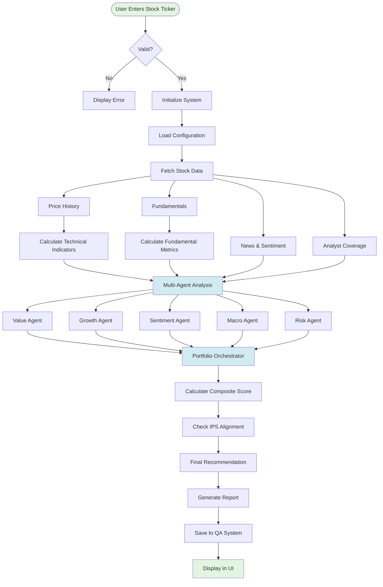
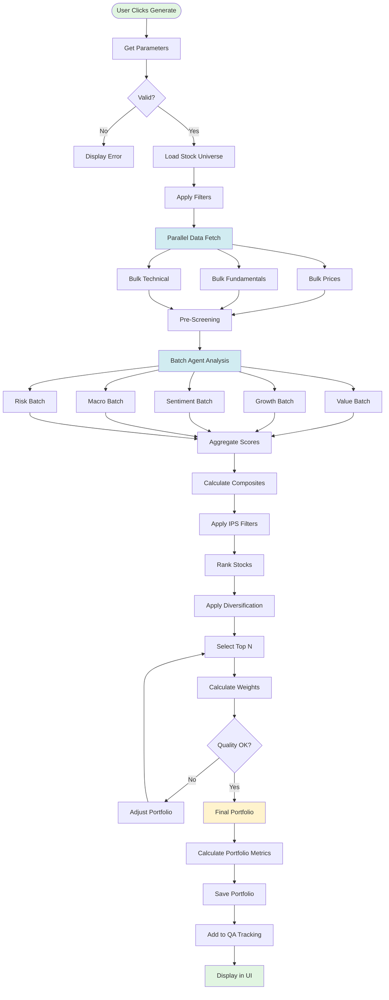
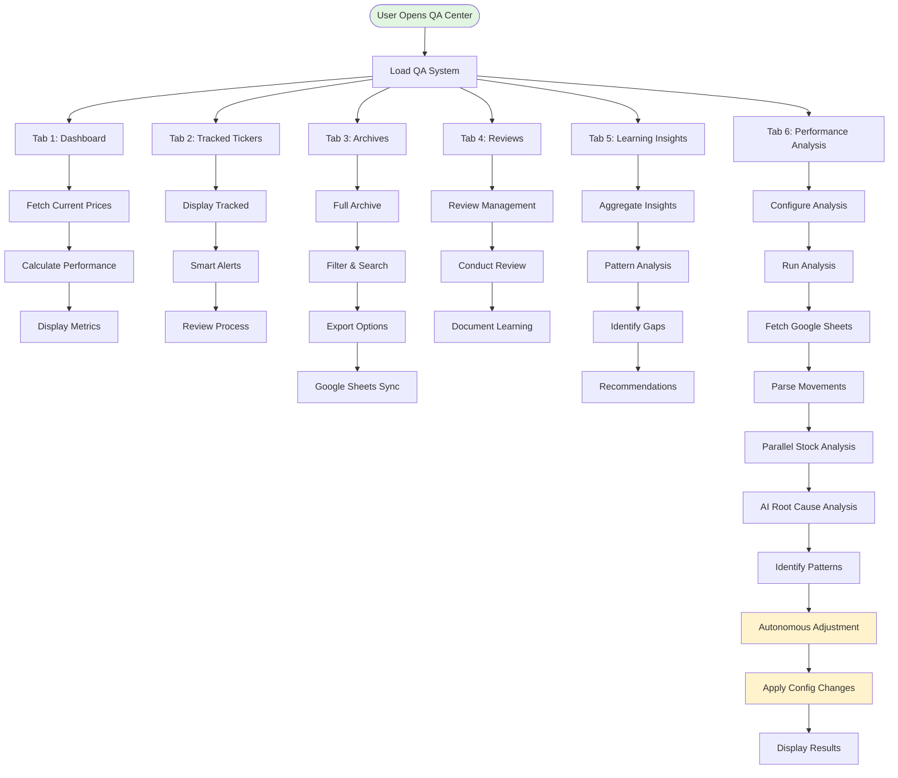
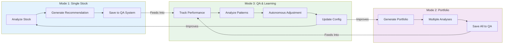
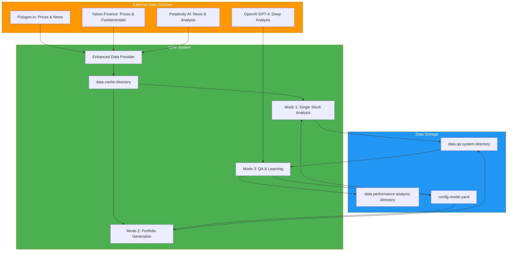

# System Architecture & Flow Diagrams

## 📊 Complete System Pipeline Visualizations

This document provides detailed Mermaid.js diagrams showing exactly what happens in each mode of the investment analysis system.

---

## 🎯 Mode 1: Pre-Determined Stock Analysis

### High-Level Flow

### Detailed Component Breakdown

**Data Fetching (5-10 seconds)**
- Price History: YFinance OHLCV data (5 years)
- Fundamentals: Company info, sector, market cap, financial metrics
- News: Perplexity AI (7-14 days) or NewsAPI fallback
- Analyst Coverage: Recommendations, target prices, ratings

**Agent Analysis (5-8 seconds)**
- **Value Agent**: P/E, P/B, P/S ratios, PEG, DCF estimates
- **Growth Agent**: Revenue/earnings growth, price momentum, volume trends
- **Sentiment Agent**: News polarity, analyst consensus, price targets
- **Macro Agent**: Sector performance, market cycle, economic indicators
- **Risk Agent**: Volatility (Beta, Std Dev), drawdown, Sharpe/Sortino ratios

**Scoring & Output (2-3 seconds)**
- Weighted composite score from all agents
- IPS alignment check (time horizon, risk tolerance, tax efficiency)
- Final recommendation: STRONG BUY / BUY / HOLD / SELL / STRONG SELL

---

## 🎲 Mode 2: Portfolio Generation

### High-Level Flow

### Detailed Component Breakdown

**Universe & Filtering (1-2 seconds)**
- Load from config/universe.yaml
- Apply sector, liquidity, data availability filters
- Result: Filtered list of candidate stocks

**Parallel Data Fetching (2-3 seconds)**
- Bulk price snapshot: Polygon.io API (all tickers in one call)
- Bulk fundamentals: ThreadPoolExecutor (10 concurrent workers)
- Bulk technical: Vectorized calculations on cached history

**Batch Agent Analysis (30-60 seconds for 50 stocks)**
- All agents process all stocks in parallel
- Rank stocks by each agent's criteria
- Generate composite scores with agent weights

**Portfolio Construction (5-10 seconds)**
- Apply IPS constraints (risk tolerance, time horizon)
- Diversification rules: Max 30% per sector, min 3 sectors
- Position sizing: Equal weight / Score-based / Risk parity
- Quality checks: Min stocks, max concentration, sector diversity

**Portfolio Metrics**
- Expected return, portfolio risk, Sharpe ratio
- Diversification score, sector allocation
- Individual stock analytics

---

## 📈 Mode 3: QA & Learning Center

### Overall Architecture

### Tab 6: Performance Analysis (Autonomous Learning)

```mermaid
graph TB
    Start([Run Performance Analysis]) --> DateRange[Select Date Range]
    DateRange --> Threshold[Set Movement Threshold]
    Threshold --> FetchData[Fetch Google Sheets Data]
    
    FetchData --> Validate{Valid Sheet?}
    Validate -->|No| ShowError[Show Available Sheets]
    Validate -->|Yes| ParseMovements[Parse Stock Movements]
    
    ParseMovements --> FilterThreshold[Filter by Threshold]
    FilterThreshold --> Dedupe[Deduplicate Tickers]
    Dedupe --> MovementList[Movement List: X up Y down]
    
    MovementList --> ParallelLoop[For Each Stock in Parallel]
    
    ParallelLoop --> FetchNews[Fetch Recent News]
    FetchNews --> Strategy1{Polygon.io}
    Strategy1 -->|Success| Got10[Got 10 articles]
    Strategy1 -->|Fail| Strategy2[get_news_with_sources]
    Strategy2 -->|Success| Got8[Got 8 articles]
    Strategy2 -->|Fail| Strategy3[Perplexity Fast Search]
    Strategy3 --> Got5[Got 5 articles]
    
    Got10 --> GetFund[Get Fundamentals]
    Got8 --> GetFund
    Got5 --> GetFund
    
    GetFund --> AIModel{Choose AI}
    AIModel -->|OpenAI| GPT4[GPT-4 Analysis]
    AIModel -->|Perplexity| Sonar[Sonar-Pro Analysis]
    
    GPT4 --> Analyze[Analyze Root Causes]
    Sonar --> Analyze
    
    Analyze --> ParseJSON[Parse Response]
    ParseJSON --> StockDone[Stock Analysis Complete]
    
    StockDone --> AllDone{All Stocks Done?}
    AllDone -->|No| ParallelLoop
    AllDone -->|Yes| IdentifyPatterns[Identify Patterns]
    
    IdentifyPatterns --> CalcFreq[Calculate Pattern Frequencies]
    CalcFreq --> AutoPhase[AUTONOMOUS ADJUSTMENT]
    
    AutoPhase --> CalcWeights[Calculate Agent Weight Changes]
    CalcWeights --> MissRate[Check Agent Miss Rates]
    MissRate --> PatternAdj[Pattern-Based Adjustments]
    
    PatternAdj --> Earnings{Earnings over 40 percent?}
    PatternAdj --> NewsPattern{News over 40 percent?}
    PatternAdj --> SectorPattern{Sector over 30 percent?}
    
    Earnings -->|Yes| IncValue[Increase Value Agent]
    NewsPattern -->|Yes| IncSent[Increase Sentiment Agent]
    SectorPattern -->|Yes| IncMacro[Increase Macro Agent]
    
    IncValue --> CalcThresh[Calculate Threshold Changes]
    IncSent --> CalcThresh
    IncMacro --> CalcThresh
    
    CalcThresh --> ConfCheck{Avg Confidence?}
    ConfCheck -->|High over 75| Aggressive[More Aggressive Thresholds]
    ConfCheck -->|Low under 50| Conservative[More Conservative Thresholds]
    
    Aggressive --> Backup[Backup config file]
    Conservative --> Backup
    
    Backup --> UpdateYAML[Update config model yaml]
    UpdateYAML --> LogHistory[Log to adjustment history]
    
    LogHistory --> DisplayResults[Display Results]
    DisplayResults --> MoveSummary[Movement Summary]
    DisplayResults --> RootCauses[Root Causes]
    DisplayResults --> AdjustReport[Adjustment Report]
    DisplayResults --> Recommendations[Model Recommendations]
    
    MoveSummary --> SaveAll[Save All Results]
    RootCauses --> SaveAll
    AdjustReport --> SaveAll
    Recommendations --> SaveAll
    
    SaveAll --> FeedbackLoop[Feedback to System]
    FeedbackLoop --> NextRun[Next Portfolio Uses New Weights]
    
    style Start fill:#e1f5e1
    style AutoPhase fill:#fff3cd
    style UpdateYAML fill:#fff3cd
    style FeedbackLoop fill:#d4edda
    style NextRun fill:#d4edda
```

### Autonomous Adjustment Logic

**Agent Weight Adjustment**
- If agent miss rate over 30 percent: Increase weight by 10-25 percent
- Earnings-driven (over 40 percent): Plus 15 percent to Value Agent
- News-driven (over 40 percent): Plus 20 percent to Sentiment Agent
- Sector-driven (over 30 percent): Plus 15 percent to Macro Agent
- Technical (over 20 percent): Plus 10 percent to Growth Agent
- Max adjustment: Plus 25 percent per run

**Threshold Adjustment**
- High confidence (over 75 percent): Lower thresholds (more aggressive)
- Low confidence (under 50 percent): Raise thresholds (more conservative)
- Moderate confidence (50-75 percent): Keep current thresholds

**Safety Features**
- Automatic backup: config model yaml backup with TIMESTAMP
- Full audit trail: adjustment history json
- Revertible changes: Can roll back to any backup
- Capped adjustments: Prevents over-correction

---

## 🔄 Cross-Mode Integration

---

## 📊 Data Flow Architecture

---

## 📝 Performance Metrics

| Metric | Mode 1 | Mode 2 | Mode 3 (Performance Analysis) |
|--------|--------|--------|-------------------------------|
| **Typical Duration** | 10-15 seconds | 2-4 minutes | 2-5 minutes |
| **API Calls** | 5-10 | 50-200 | 100-500 |
| **Stocks Analyzed** | 1 | 5-50 | All with over 15 percent movement |
| **Outputs** | 1 recommendation | 1 portfolio | Learning updates plus config changes |
| **Storage Impact** | ~50KB | ~500KB-2MB | ~1-5MB |
| **Autonomous Actions** | None | None | **Yes: Modifies config model yaml** |

---

## 🎯 Key Features Summary

### Mode 1: Single Stock Analysis
- Real-time data from multiple sources
- 5 specialized AI agents
- IPS alignment checking
- Comprehensive reporting
- Automatic QA tracking

### Mode 2: Portfolio Generation
- Parallel bulk processing (50-60 percent faster)
- Smart diversification rules
- Multiple weighting strategies
- Quality checks and constraints
- Full portfolio analytics

### Mode 3: QA & Learning Center
- Continuous performance tracking
- Smart alert system
- Pattern identification
- **Autonomous self-adjustment**
- **Automatically modifies agent weights**
- **Learns from mistakes**
- Google Sheets integration

---

## 🚀 Getting Started

1. **Single Stock Analysis**: Enter ticker → Get recommendation in 10-15 seconds
2. **Portfolio Generation**: Set parameters → Get diversified portfolio in 2-4 minutes  
3. **Performance Analysis**: Run weekly → System learns and improves automatically

The system continuously learns from its performance and automatically adjusts its configuration to improve future predictions. No manual intervention required!

---

*These diagrams are rendered natively on GitHub. View them at: https://github.com/yaboibean2/Wharton/blob/main/SYSTEM_FLOW_DIAGRAMS.md*
