```mermaid
graph TB
    Start([User Clicks Generate Portfolio]) --> GetParams[Get User Parameters]
    
    GetParams --> InputCheck{Input Validation}
    InputCheck --> CheckNum[Number of stocks: 5-50]
    InputCheck --> CheckRisk[Risk tolerance: Conservative/Moderate/Aggressive]
    InputCheck --> CheckHorizon[Time horizon: Short/Medium/Long]
    InputCheck --> CheckFocus[Sector focus: Optional filters]
    
    InputCheck -->|Invalid| Error[Display Error Message]
    InputCheck -->|Valid| LoadUniverse[Load Stock Universe]
    
    LoadUniverse --> UniverseSource[Read config/universe.yaml]
    UniverseSource --> ParseSectors[Parse by Sectors:<br/>- Technology<br/>- Healthcare<br/>- Finance<br/>- Consumer<br/>- Energy<br/>- etc.]
    
    ParseSectors --> FilterUniverse{Apply Filters}
    FilterUniverse --> SectorFilter[Sector Filter<br/>if specified]
    FilterUniverse --> LiquidityFilter[Liquidity Filter:<br/>- Market cap > $1B<br/>- Avg volume > 100K]
    FilterUniverse --> DataFilter[Data Availability Filter:<br/>- Must have price history<br/>- Must have fundamentals]
    
    SectorFilter --> FilteredList[Filtered Stock List]
    LiquidityFilter --> FilteredList
    DataFilter --> FilteredList
    
    FilteredList --> ParallelFetch[Parallel Data Fetching]
    ParallelFetch --> BulkPrices[Bulk Price Data Fetch]
    BulkPrices --> PolygonBulk{Polygon.io Available?}
    PolygonBulk -->|Yes| PolygonSnapshot[Polygon Snapshot API:<br/>- All tickers in one call<br/>- Current prices<br/>- Volume data<br/>- ~2-3 seconds]
    PolygonBulk -->|No| YFinanceBulk[YFinance Batch:<br/>- Chunked requests<br/>- 50 tickers per batch<br/>- ~5-10 seconds]
    
    ParallelFetch --> BulkFundamentals[Bulk Fundamental Data]
    BulkFundamentals --> ThreadPool[ThreadPoolExecutor:<br/>- 10 concurrent workers<br/>- Fetch key metrics<br/>- Cache results]
    
    ParallelFetch --> BulkTechnical[Bulk Technical Analysis]
    BulkTechnical --> CachedHistory[Use Cached Price History<br/>or fetch if missing]
    CachedHistory --> TechnicalCalc[Calculate Indicators:<br/>- Batch processing<br/>- Vectorized operations<br/>- ~1-2 seconds per 50 stocks]
    
    PolygonSnapshot --> DataReady[All Data Ready]
    YFinanceBulk --> DataReady
    ThreadPool --> DataReady
    TechnicalCalc --> DataReady
    
    DataReady --> PreScreening[Pre-Screening Phase]
    PreScreening --> QuickFilters[Apply Quick Filters]
    QuickFilters --> PriceFilter[Price: $5 - $500]
    QuickFilters --> VolumeFilter[Volume: > 100K daily]
    QuickFilters --> DataQuality[Data Quality: Complete]
    
    PriceFilter --> ScreenedList[Screened Stock List]
    VolumeFilter --> ScreenedList
    DataQuality --> ScreenedList
    
    ScreenedList --> BatchAnalysis[Batch Agent Analysis]
    BatchAnalysis --> ParallelAgents[Parallel Agent Execution]
    
    ParallelAgents --> ValueBatch[Value Agent Batch:<br/>- Process all stocks<br/>- Calculate P/E, P/B, etc.<br/>- Rank by value score]
    ParallelAgents --> GrowthBatch[Growth Agent Batch:<br/>- Calculate growth rates<br/>- Momentum indicators<br/>- Rank by growth score]
    ParallelAgents --> SentimentBatch[Sentiment Agent Batch:<br/>- News sentiment aggregation<br/>- Analyst consensus<br/>- Rank by sentiment score]
    ParallelAgents --> MacroBatch[Macro Agent Batch:<br/>- Sector performance<br/>- Market regime<br/>- Rank by macro score]
    ParallelAgents --> RiskBatch[Risk Agent Batch:<br/>- Volatility metrics<br/>- Drawdown analysis<br/>- Rank by risk score]
    
    ValueBatch --> AgentScores[Aggregate Agent Scores]
    GrowthBatch --> AgentScores
    SentimentBatch --> AgentScores
    MacroBatch --> AgentScores
    RiskBatch --> AgentScores
    
    AgentScores --> CompositeScoring[Calculate Composite Scores]
    CompositeScoring --> WeightedCalc[Apply Agent Weights<br/>from config/model.yaml]
    WeightedCalc --> IPSFilter[Apply IPS Constraints]
    
    IPSFilter --> RiskMatch{Risk Tolerance Match}
    RiskMatch -->|Conservative| LowRisk[Filter: Beta < 0.8<br/>Max Drawdown < 15%]
    RiskMatch -->|Moderate| MedRisk[Filter: Beta 0.8-1.2<br/>Max Drawdown < 25%]
    RiskMatch -->|Aggressive| HighRisk[Filter: Beta > 1.0<br/>Allow higher volatility]
    
    LowRisk --> HorizonMatch{Time Horizon Match}
    MedRisk --> HorizonMatch
    HighRisk --> HorizonMatch
    
    HorizonMatch -->|Short| ShortFocus[Favor: Momentum<br/>Recent strength<br/>Technical breakouts]
    HorizonMatch -->|Medium| MedFocus[Balanced: Growth + Value<br/>Fundamental + Technical]
    HorizonMatch -->|Long| LongFocus[Favor: Value<br/>Strong fundamentals<br/>Dividend growth]
    
    ShortFocus --> RankedList[Ranked Stock List]
    MedFocus --> RankedList
    LongFocus --> RankedList
    
    RankedList --> Diversification[Apply Diversification Rules]
    Diversification --> SectorBalance[Sector Balance:<br/>- Max 30% per sector<br/>- Min 3 sectors represented]
    Diversification --> CorrelationCheck[Correlation Check:<br/>- Avoid highly correlated pairs<br/>- Target correlation < 0.7]
    Diversification --> SizeBalance[Market Cap Balance:<br/>- Mix of large/mid/small cap<br/>- Based on risk tolerance]
    
    SectorBalance --> SelectTop[Select Top N Stocks]
    CorrelationCheck --> SelectTop
    SizeBalance --> SelectTop
    
    SelectTop --> IterativeSelection[Iterative Selection Process]
    IterativeSelection --> SelectBest[1. Select highest scoring stock]
    SelectBest --> CheckConstraints{Meets All Constraints?}
    CheckConstraints -->|No| SkipStock[Skip to next stock]
    CheckConstraints -->|Yes| AddToPortfolio[Add to Portfolio]
    
    SkipStock --> MoreNeeded{Need More Stocks?}
    AddToPortfolio --> MoreNeeded
    MoreNeeded -->|Yes| SelectBest
    MoreNeeded -->|No| PositionSizing[Calculate Position Sizes]
    
    PositionSizing --> WeightingStrategy{Weighting Strategy}
    WeightingStrategy -->|Equal Weight| EqualWeight[Equal Weight:<br/>100% / N stocks]
    WeightingStrategy -->|Score Weight| ScoreWeight[Score-Based Weight:<br/>Higher scores = larger positions]
    WeightingStrategy -->|Risk Parity| RiskParity[Risk Parity:<br/>Equal risk contribution]
    
    EqualWeight --> FinalPortfolio[Final Portfolio Construction]
    ScoreWeight --> FinalPortfolio
    RiskParity --> FinalPortfolio
    
    FinalPortfolio --> PortfolioMetrics[Calculate Portfolio Metrics]
    PortfolioMetrics --> ExpectedReturn[Expected Return:<br/>Σ stock_return × weight]
    PortfolioMetrics --> PortfolioRisk[Portfolio Risk:<br/>√Σ weight² × variance]
    PortfolioMetrics --> SharpeRatio[Sharpe Ratio:<br/>Return / Risk]
    PortfolioMetrics --> Diversification[Diversification Score:<br/>Sector spread × Correlation]
    
    ExpectedReturn --> QualityChecks[Portfolio Quality Checks]
    PortfolioRisk --> QualityChecks
    SharpeRatio --> QualityChecks
    Diversification --> QualityChecks
    
    QualityChecks --> MinStocks{Min 5 Stocks?}
    QualityChecks --> MaxConcentration{Max Position < 30%?}
    QualityChecks --> SectorDiversity{3+ Sectors?}
    
    MinStocks -->|No| RegenerateError[Error: Insufficient stocks]
    MinStocks -->|Yes| QualityPass[Quality Checks Pass]
    MaxConcentration -->|No| AdjustWeights[Adjust Weights]
    MaxConcentration -->|Yes| QualityPass
    SectorDiversity -->|No| AddDiversity[Add Diverse Stocks]
    SectorDiversity -->|Yes| QualityPass
    
    AdjustWeights --> FinalPortfolio
    AddDiversity --> IterativeSelection
    
    QualityPass --> GenerateReport[Generate Portfolio Report]
    GenerateReport --> SummarySection[Summary Section:<br/>- Total stocks<br/>- Expected return<br/>- Risk metrics<br/>- Diversification score]
    GenerateReport --> HoldingsTable[Holdings Table:<br/>- Ticker<br/>- Company<br/>- Weight<br/>- Scores<br/>- Metrics]
    GenerateReport --> AnalysisCards[Individual Analysis Cards<br/>for each stock]
    GenerateReport --> PortfolioCharts[Portfolio Charts:<br/>- Sector allocation pie<br/>- Risk/return scatter<br/>- Score distribution<br/>- Correlation matrix]
    
    SummarySection --> SavePortfolio[Save Portfolio]
    HoldingsTable --> SavePortfolio
    AnalysisCards --> SavePortfolio
    PortfolioCharts --> SavePortfolio
    
    SavePortfolio --> PortfolioStorage[data/saved_portfolios.json:<br/>- Portfolio ID<br/>- Timestamp<br/>- Parameters<br/>- Holdings<br/>- Metrics]
    
    PortfolioStorage --> QATracking[Add to QA Tracking]
    QATracking --> TrackAll[Track All Holdings:<br/>- Individual performance<br/>- Portfolio performance<br/>- Rebalancing needs]
    
    TrackAll --> DisplayUI[Display in Streamlit UI]
    DisplayUI --> UIRender[Render Components:<br/>- Summary cards<br/>- Holdings table<br/>- Interactive charts<br/>- Export options<br/>- Backtest option]
    
    UIRender --> UserActions{User Action}
    UserActions -->|Export| ExportOptions[Export Portfolio:<br/>- PDF Report<br/>- CSV Holdings<br/>- JSON Full Data]
    UserActions -->|Backtest| BacktestFlow[→ Mode 3: Backtesting]
    UserActions -->|Save| SaveToProfiles[Save to profiles/]
    UserActions -->|New| Start
    
    style Start fill:#e1f5e1
    style DisplayUI fill:#e1f5e1
    style ParallelFetch fill:#d1ecf1
    style BatchAnalysis fill:#d1ecf1
    style FinalPortfolio fill:#fff3cd
```

# System Architecture & Flow Diagrams

## 📊 Complete System Pipeline Visualizations

This document provides detailed Mermaid.js diagrams showing exactly what happens in each mode of the investment analysis system.

---

## 🎯 Mode 1: Pre-Determined Stock Analysis

### Detailed Flow

```mermaid
graph TB
    Start([User Enters Stock Ticker]) --> ValidateInput{Valid Ticker?}
    ValidateInput -->|No| Error1[Display Error: Invalid Ticker]
    ValidateInput -->|Yes| InitSystem[Initialize System Components]
    
    InitSystem --> LoadConfig[Load Configuration]
    LoadConfig --> LoadYAML[Load config/model.yaml<br/>- Agent weights<br/>- IPS parameters<br/>- Thresholds]
    LoadYAML --> LoadIPS[Load config/ips.yaml<br/>- Time horizon<br/>- Risk tolerance<br/>- Tax considerations]
    
    LoadConfig --> InitProviders[Initialize Data Providers]
    InitProviders --> CheckAPIs{Check Available APIs}
    CheckAPIs --> PolygonCheck[Polygon.io API]
    CheckAPIs --> PerplexityCheck[Perplexity AI API]
    CheckAPIs --> OpenAICheck[OpenAI API]
    CheckAPIs --> YFinanceCheck[YFinance Fallback]
    
    InitProviders --> DataFetch[Fetch Stock Data]
    
    DataFetch --> PriceData[Get Price History]
    PriceData --> YFinancePrice[YFinance: Historical OHLCV]
    YFinancePrice --> PriceCache{Cache Available?}
    PriceCache -->|Yes| LoadCache1[Load from data/cache/]
    PriceCache -->|No| FetchPrice[Fetch & Cache 5 years data]
    
    DataFetch --> FundamentalData[Get Fundamental Data]
    FundamentalData --> YFinanceFund[YFinance: Company Info<br/>- Sector, Industry<br/>- Market Cap<br/>- Financial Metrics]
    
    DataFetch --> NewsData[Get News & Sentiment]
    NewsData --> PerplexityNews{Perplexity Available?}
    PerplexityNews -->|Yes| PerplexityAPI[Perplexity: Recent News<br/>- Last 7-14 days<br/>- Financial focus<br/>- Sentiment analysis]
    PerplexityNews -->|No| AlternativeNews[Alternative Sources<br/>- NewsAPI<br/>- Yahoo Finance News]
    
    DataFetch --> AnalystData[Get Analyst Coverage]
    AnalystData --> YFinanceAnalyst[YFinance: Analyst Data<br/>- Recommendations<br/>- Target prices<br/>- Rating history]
    
    FetchPrice --> CalculateMetrics[Calculate Technical Indicators]
    CalculateMetrics --> TechIndicators[Compute Indicators:<br/>- RSI, MACD, Bollinger Bands<br/>- Moving averages<br/>- Volume trends<br/>- Momentum indicators]
    
    YFinanceFund --> FundMetrics[Calculate Fundamental Metrics]
    FundMetrics --> Valuation[Valuation Metrics:<br/>- P/E, P/B, P/S ratios<br/>- PEG ratio<br/>- EV/EBITDA<br/>- DCF estimates]
    
    TechIndicators --> AgentAnalysis[Multi-Agent Analysis]
    FundMetrics --> AgentAnalysis
    PerplexityAPI --> AgentAnalysis
    YFinanceAnalyst --> AgentAnalysis
    
    AgentAnalysis --> ValueAgent[Value Agent Analysis]
    ValueAgent --> ValueMetrics[Analyze:<br/>- Current valuation vs historical<br/>- Peer comparison<br/>- Graham number<br/>- Margin of safety<br/>- Free cash flow]
    ValueMetrics --> ValueScore[Generate Value Score: 0-100]
    ValueScore --> ValueRationale[Create Detailed Rationale]
    
    AgentAnalysis --> GrowthAgent[Growth & Momentum Agent]
    GrowthAgent --> GrowthMetrics[Analyze:<br/>- Revenue growth trends<br/>- Earnings growth trajectory<br/>- Price momentum<br/>- Volume trends<br/>- Relative strength]
    GrowthMetrics --> GrowthScore[Generate Growth Score: 0-100]
    GrowthScore --> GrowthRationale[Create Detailed Rationale]
    
    AgentAnalysis --> SentimentAgent[Sentiment Agent]
    SentimentAgent --> SentimentMetrics[Analyze:<br/>- News sentiment polarity<br/>- Analyst ratings consensus<br/>- Price target changes<br/>- Social sentiment<br/>- Headline analysis]
    SentimentMetrics --> SentimentScore[Generate Sentiment Score: 0-100]
    SentimentScore --> SentimentRationale[Create Detailed Rationale]
    
    AgentAnalysis --> MacroAgent[Macro Regime Agent]
    MacroAgent --> MacroMetrics[Analyze:<br/>- Sector performance<br/>- Market cycle position<br/>- Economic indicators<br/>- Interest rate impact<br/>- Sector rotation]
    MacroMetrics --> MacroScore[Generate Macro Score: 0-100]
    MacroScore --> MacroRationale[Create Detailed Rationale]
    
    AgentAnalysis --> RiskAgent[Risk Agent]
    RiskAgent --> RiskMetrics[Analyze:<br/>- Volatility (Beta, Std Dev)<br/>- Max drawdown<br/>- Sharpe/Sortino ratios<br/>- Downside risk<br/>- Correlation analysis]
    RiskMetrics --> RiskScore[Generate Risk Score: 0-100]
    RiskScore --> RiskRationale[Create Detailed Rationale]
    
    ValueRationale --> Orchestrator[Portfolio Orchestrator]
    GrowthRationale --> Orchestrator
    SentimentRationale --> Orchestrator
    MacroRationale --> Orchestrator
    RiskRationale --> Orchestrator
    
    Orchestrator --> WeightScores[Apply Agent Weights]
    WeightScores --> ConfigWeights[Use config/model.yaml weights:<br/>- value: 1.0<br/>- growth_momentum: 1.0<br/>- sentiment: 1.0<br/>- macro_regime: 1.0<br/>- risk: 1.0]
    
    ConfigWeights --> CompositeScore[Calculate Composite Score]
    CompositeScore --> WeightedAvg[Weighted Average:<br/>Σ agent_score × weight / Σ weights]
    
    WeightedAvg --> IPSAlignment[Check IPS Alignment]
    IPSAlignment --> TimeHorizon{Matches Time Horizon?}
    IPSAlignment --> RiskTolerance{Within Risk Tolerance?}
    IPSAlignment --> TaxImpact{Tax Efficient?}
    
    TimeHorizon --> IPSScore[IPS Alignment Score]
    RiskTolerance --> IPSScore
    TaxImpact --> IPSScore
    
    IPSScore --> FinalScore[Calculate Final Confidence Score]
    FinalScore --> Confidence[Confidence: 0-100<br/>= Composite × IPS Alignment]
    
    Confidence --> RecommendationLogic{Determine Recommendation}
    RecommendationLogic -->|Score ≥ 70| StrongBuy[STRONG BUY]
    RecommendationLogic -->|60 ≤ Score < 70| Buy[BUY]
    RecommendationLogic -->|40 ≤ Score < 60| Hold[HOLD]
    RecommendationLogic -->|30 ≤ Score < 40| Sell[SELL]
    RecommendationLogic -->|Score < 30| StrongSell[STRONG SELL]
    
    StrongBuy --> GenerateReport[Generate Analysis Report]
    Buy --> GenerateReport
    Hold --> GenerateReport
    Sell --> GenerateReport
    StrongSell --> GenerateReport
    
    GenerateReport --> ReportSections[Create Report Sections]
    ReportSections --> ExecutiveSummary[Executive Summary:<br/>- Recommendation<br/>- Confidence score<br/>- Key highlights<br/>- Risk summary]
    ReportSections --> DetailedAnalysis[Detailed Agent Analysis:<br/>- Each agent's findings<br/>- Scores and rationales<br/>- Supporting data]
    ReportSections --> DataTables[Data Tables:<br/>- Financial metrics<br/>- Technical indicators<br/>- Analyst coverage]
    ReportSections --> Charts[Interactive Charts:<br/>- Price history<br/>- Technical indicators<br/>- Agent scores radar]
    
    GenerateReport --> SaveToQA[Save to QA System]
    SaveToQA --> QAStorage[Store in data/qa_system/:<br/>- recommendations.json<br/>- all_analyses.json<br/>- Timestamp & metadata]
    
    QAStorage --> AIDisclosure[Log AI Disclosure]
    AIDisclosure --> DisclosureLog[logs/ai_disclosure_YYYYMMDD.jsonl:<br/>- Analysis timestamp<br/>- AI model used<br/>- Confidence level<br/>- Disclaimer included]
    
    DisclosureLog --> DisplayUI[Display in Streamlit UI]
    DisplayUI --> UIComponents[Render Components:<br/>- Recommendation badge<br/>- Score gauges<br/>- Agent analysis cards<br/>- Interactive charts<br/>- Export options]
    
    UIComponents --> UserActions{User Action}
    UserActions -->|Export| ExportReport[Export as PDF/CSV/JSON]
    UserActions -->|Track| AddToTracking[Add to QA Tracking]
    UserActions -->|New Analysis| Start
    
    AddToTracking --> QASystem[QA System Tracks Performance]
    QASystem --> TrackPrice[Monitor Price Changes]
    QASystem --> TrackOutcome[Record Actual Outcomes]
    QASystem --> LearningLoop[Feed into Performance Analysis<br/>for Autonomous Learning]
    
    style Start fill:#e1f5e1
    style DisplayUI fill:#e1f5e1
    style LearningLoop fill:#fff3cd
    style Orchestrator fill:#d1ecf1
    style AgentAnalysis fill:#d1ecf1
```

---

## 🎲 Mode 2: Portfolio Generation

### Detailed Flow



---

## 📈 Mode 3: QA & Learning Center

### Detailed Flow

```mermaid
graph TB
    Start([User Opens QA Center]) --> LoadQASystem[Initialize QA System]
    
    LoadQASystem --> LoadStorage[Load Storage Files]
    LoadStorage --> LoadRecs[data/qa_system/recommendations.json:<br/>- All tracked recommendations<br/>- Timestamps<br/>- Initial analysis]
    LoadStorage --> LoadAnalyses[data/qa_system/all_analyses.json:<br/>- Complete analysis archive<br/>- Agent scores & rationales<br/>- Market data snapshots]
    LoadStorage --> LoadReviews[data/qa_system/reviews.json:<br/>- Weekly review records<br/>- Performance notes<br/>- Learning insights]
    
    LoadRecs --> ParseData[Parse & Organize Data]
    LoadAnalyses --> ParseData
    LoadReviews --> ParseData
    
    ParseData --> BuildArchive[Build Analysis Archive]
    BuildArchive --> GroupByTicker[Group by Ticker:<br/>- Chronological order<br/>- Multiple analyses per stock]
    BuildArchive --> GroupByDate[Group by Date:<br/>- Daily/weekly views<br/>- Time-series tracking]
    
    GroupByTicker --> DashboardTab[Tab 1: Dashboard]
    
    DashboardTab --> CurrentPrices[Fetch Current Prices]
    CurrentPrices --> PriceUpdate{Update Method}
    PriceUpdate -->|Auto| ScheduledUpdate[Scheduled Update:<br/>- Every 15 minutes<br/>- Market hours only]
    PriceUpdate -->|Manual| ManualRefresh[Manual Refresh Button]
    PriceUpdate -->|Bulk| BulkPriceSync[Bulk Price Sync:<br/>- All tracked tickers<br/>- Polygon/YFinance<br/>- ~2-3 seconds]
    
    ScheduledUpdate --> PriceCache[Update Price Cache]
    ManualRefresh --> PriceCache
    BulkPriceSync --> PriceCache
    
    PriceCache --> CalcPerformance[Calculate Performance Metrics]
    CalcPerformance --> IndividualPerf[Individual Stock Performance:<br/>- Price at analysis<br/>- Current price<br/>- % change<br/>- Realized gain/loss]
    CalcPerformance --> AccuracyMetrics[Accuracy Metrics:<br/>- Correct calls: Recommendation direction matches price movement<br/>- Accuracy rate: % correct / total<br/>- Average confidence vs actual outcome]
    CalcPerformance --> TimeAnalysis[Time-Series Analysis:<br/>- Performance by timeframe<br/>- Momentum tracking<br/>- Trend analysis]
    
    IndividualPerf --> DisplayMetrics[Display Dashboard Metrics]
    AccuracyMetrics --> DisplayMetrics
    TimeAnalysis --> DisplayMetrics
    
    DisplayMetrics --> SummaryCards[Summary Cards:<br/>- Total tracked stocks<br/>- Overall accuracy<br/>- Best/worst performers<br/>- Pending reviews]
    DisplayMetrics --> PerformanceTable[Performance Table:<br/>- Ticker<br/>- Recommendation<br/>- Initial price<br/>- Current price<br/>- Change %<br/>- Status]
    DisplayMetrics --> PerformanceCharts[Performance Charts:<br/>- Win/loss distribution<br/>- Accuracy by agent<br/>- Return distribution<br/>- Time series performance]
    
    SummaryCards --> AlertSystem[Smart Alert System]
    AlertSystem --> NeedReview{Needs Review?}
    NeedReview -->|Price >20% change| HighChangeAlert[🔴 High Change Alert]
    NeedReview -->|30+ days old| TimeAlert[⏰ Time-Based Review Alert]
    NeedReview -->|New earnings| EarningsAlert[📊 Earnings Event Alert]
    NeedReview -->|Rec vs reality mismatch| MismatchAlert[⚠️ Prediction Mismatch Alert]
    
    HighChangeAlert --> TrackedTab[Tab 2: Tracked Tickers]
    TimeAlert --> TrackedTab
    EarningsAlert --> TrackedTab
    MismatchAlert --> TrackedTab
    
    TrackedTab --> TickerList[Display Tracked Tickers]
    TickerList --> TickerCards[Ticker Cards:<br/>- Company name & sector<br/>- Recommendation badge<br/>- Current performance<br/>- Alert indicators<br/>- Quick actions]
    
    TickerCards --> UserSelect{User Selection}
    UserSelect -->|Click Ticker| DetailView[Detailed Analysis View]
    UserSelect -->|Review| ReviewFlow[Start Review Process]
    UserSelect -->|Delete| RemoveTracking[Remove from Tracking]
    
    DetailView --> LoadHistory[Load Complete History]
    LoadHistory --> AllAnalyses[All Analyses for Ticker:<br/>- Historical recommendations<br/>- Price changes<br/>- News events<br/>- Performance tracking]
    
    AllAnalyses --> ComparisonView[Comparison View:<br/>- Recommendation vs Actual<br/>- Agent scores vs Reality<br/>- What worked / didn't work]
    
    ComparisonView --> ArchiveTab[Tab 3: Complete Archives]
    
    ArchiveTab --> FullArchive[Full Analysis Archive]
    FullArchive --> FilterOptions[Filter Options:<br/>- By date range<br/>- By ticker<br/>- By recommendation type<br/>- By performance<br/>- By sector]
    
    FilterOptions --> SearchFunc[Search Functionality:<br/>- Ticker search<br/>- Keyword search<br/>- Advanced filters]
    
    SearchFunc --> ExportArchive[Export Options:<br/>- CSV: All data<br/>- JSON: Full structure<br/>- PDF: Selected analyses<br/>- Batch export]
    
    ExportArchive --> SheetsSync[Google Sheets Sync]
    SheetsSync --> SheetsOptions{Sync Options}
    SheetsOptions --> QuickSync[Quick Sync:<br/>- Update existing rows<br/>- Add new analyses<br/>- ~5-10 seconds]
    SheetsOptions --> FullSync[Full Sync:<br/>- Complete refresh<br/>- Fetch current prices<br/>- Calculate performance<br/>- ~30-60 seconds]
    SheetsOptions --> CustomSync[Custom Sync:<br/>- Select date range<br/>- Choose columns<br/>- Filter by criteria]
    
    QuickSync --> UpdateSheet[Update Google Sheet:<br/>- Price Analysis tab<br/>- Historical data<br/>- Performance tracking]
    FullSync --> UpdateSheet
    CustomSync --> UpdateSheet
    
    UpdateSheet --> ReviewsTab[Tab 4: Weekly Reviews]
    
    ReviewsTab --> ReviewSchedule[Review Management]
    ReviewSchedule --> AutoSchedule[Auto-Generated Reviews:<br/>- Every 7 days<br/>- Stocks needing attention<br/>- Performance summaries]
    
    AutoSchedule --> ReviewTemplate[Review Template:<br/>1. Performance Summary<br/>2. Notable Changes<br/>3. Lessons Learned<br/>4. Model Improvements Needed]
    
    ReviewTemplate --> ConductReview[Conduct Review]
    ConductReview --> StockByStock[Stock-by-Stock Review:<br/>- What happened?<br/>- Why did it happen?<br/>- Did model predict correctly?<br/>- What was missed?]
    
    StockByStock --> DocumentLearning[Document Learning Insights:<br/>- Patterns observed<br/>- Model gaps identified<br/>- Improvement suggestions<br/>- Success factors]
    
    DocumentLearning --> SaveReview[Save Review Record]
    SaveReview --> ReviewStorage[data/qa_system/reviews.json:<br/>- Review ID<br/>- Timestamp<br/>- Stocks reviewed<br/>- Insights<br/>- Action items]
    
    ReviewStorage --> LearningTab[Tab 5: Learning Insights]
    
    LearningTab --> AggregateInsights[Aggregate Learning Insights]
    AggregateInsights --> PatternAnalysis[Pattern Analysis:<br/>- Common success factors<br/>- Common failure factors<br/>- Agent performance patterns<br/>- Sector patterns<br/>- Market condition patterns]
    
    PatternAnalysis --> ModelGaps[Identify Model Gaps:<br/>- What agents missed<br/>- Feature gaps<br/>- Timing issues<br/>- Data quality issues]
    
    ModelGaps --> Recommendations[Generate Recommendations:<br/>- Agent weight adjustments<br/>- Feature improvements<br/>- New data sources<br/>- Threshold changes]
    
    Recommendations --> PerformanceAnalysisTab[Tab 6: Performance Analysis]
    
    PerformanceAnalysisTab --> ConfigureAnalysis[Configure Analysis]
    ConfigureAnalysis --> DateSelection[Select Date Range:<br/>- Last week<br/>- Last month<br/>- Last quarter<br/>- Custom range]
    ConfigureAnalysis --> ThresholdSetting[Set Movement Threshold:<br/>- Default: 15%<br/>- Range: 1-50%<br/>- Captures significant moves]
    ConfigureAnalysis --> DebugMode[Debug Mode:<br/>- Verbose logging<br/>- Data inspection<br/>- Step-by-step tracking]
    
    DateSelection --> RunAnalysis[Run Analysis Button]
    ThresholdSetting --> RunAnalysis
    DebugMode --> RunAnalysis
    
    RunAnalysis --> FetchSheets[Fetch Google Sheets Data]
    FetchSheets --> ValidateWorksheet{Valid Worksheet?}
    ValidateWorksheet -->|No| WorksheetError[Display Available Worksheets<br/>Suggest correct name]
    ValidateWorksheet -->|Yes| LoadData[Load Historical Price Analysis]
    
    LoadData --> ParseMovements[Parse Stock Movements]
    ParseMovements --> CheckThreshold[Check Against Threshold:<br/>- Percent Change ≥ threshold<br/>- Both up and down movements]
    
    CheckThreshold --> DeduplicateTickers[Deduplicate Tickers:<br/>- Keep largest movement<br/>- Avoid duplicate analysis]
    
    DeduplicateTickers --> MovementList[Unique Movement List:<br/>- X stocks UP<br/>- Y stocks DOWN<br/>- Total: X+Y movements]
    
    MovementList --> ParallelAnalysis[Parallel Stock Analysis]
    ParallelAnalysis --> PerStock[For Each Stock:]
    
    PerStock --> FetchNews[Fetch Recent News:<br/>1. Polygon.io (10 articles)<br/>2. get_news_with_sources (8 more)<br/>3. Perplexity web search (if <5)]
    PerStock --> GetFundamentals[Get Fundamentals:<br/>- Sector<br/>- Market cap<br/>- Financial metrics<br/>(if available)]
    
    FetchNews --> AIAnalysis[AI Root Cause Analysis]
    GetFundamentals --> AIAnalysis
    
    AIAnalysis --> ChooseModel{AI Model}
    ChooseModel -->|OpenAI| GPT4[GPT-4:<br/>- Deep analysis<br/>- Specific catalysts<br/>- 1500 tokens]
    ChooseModel -->|Perplexity| SonarPro[Sonar-Pro:<br/>- Web search<br/>- Real-time data<br/>- 1500 tokens]
    
    GPT4 --> AnalyzePrompt[Analyze Prompt:<br/>- Why did stock move X%?<br/>- Find specific catalysts<br/>- Earnings, news, analyst actions<br/>- Dates and numbers required]
    SonarPro --> AnalyzePrompt
    
    AnalyzePrompt --> ParseResponse[Parse AI Response]
    ParseResponse --> ExtractJSON[Extract JSON:<br/>- root_causes: 3-5 specific reasons<br/>- confidence: 0-100<br/>- catalyst_summary<br/>- agent_relevance<br/>- model_gaps]
    
    ExtractJSON --> StockAnalysis[Complete Stock Analysis:<br/>- Movement data<br/>- News articles<br/>- Root causes<br/>- AI insights]
    
    StockAnalysis --> AllDone{All Stocks Done?}
    AllDone -->|No| PerStock
    AllDone -->|Yes| PatternIdentification[Identify Patterns Across All]
    
    PatternIdentification --> CalculateFrequencies[Calculate Pattern Frequencies:<br/>- % earnings-related<br/>- % news-driven<br/>- % sector-driven<br/>- % technical breakouts<br/>- Average confidence]
    
    CalculateFrequencies --> AutonomousAdjustment[🤖 Autonomous Adjustment Phase]
    
    AutonomousAdjustment --> CalculateWeights[Calculate Agent Weight Adjustments]
    CalculateWeights --> AgentMissRate[Analyze Agent Miss Rates:<br/>- Which agents should have caught<br/>- Miss rate > 30% threshold<br/>- Calculate weight increase]
    
    AgentMissRate --> PatternWeights[Pattern-Based Adjustments:<br/>- >40% earnings → +15% value<br/>- >40% news → +20% sentiment<br/>- >30% sector → +15% macro<br/>- >20% extreme → +10% risk]
    
    PatternWeights --> ThresholdAdj[Calculate Threshold Adjustments]
    ThresholdAdj --> ConfidenceCheck{Avg Confidence}
    ConfidenceCheck -->|>75%| Aggressive[More Aggressive:<br/>- Lower upside min<br/>- Lower conviction threshold]
    ConfidenceCheck -->|<50%| Conservative[More Conservative:<br/>- Raise upside min<br/>- Raise conviction threshold]
    
    Aggressive --> ApplyChanges[Apply Changes to Config]
    Conservative --> ApplyChanges
    PatternWeights --> ApplyChanges
    
    ApplyChanges --> BackupConfig[Create Config Backup:<br/>config/model.yaml.backup.TIMESTAMP]
    BackupConfig --> UpdateYAML[Update config/model.yaml:<br/>- New agent weights<br/>- New thresholds<br/>- Atomic write operation]
    
    UpdateYAML --> LogAdjustments[Log All Adjustments]
    LogAdjustments --> AdjustmentHistory[data/performance_analysis/adjustment_history.json:<br/>- Timestamp<br/>- Changes made<br/>- Before/after values<br/>- Rationale]
    
    AdjustmentHistory --> DisplayResults[Display Results in UI]
    DisplayResults --> MovementSummary[Movement Summary:<br/>- X up, Y down<br/>- Top gainers<br/>- Top losers]
    DisplayResults --> AnalysisResults[Analysis Results:<br/>- Root causes per stock<br/>- Pattern frequencies<br/>- Confidence levels]
    DisplayResults --> AdjustmentSummary[🤖 Autonomous Adjustments:<br/>- Agent weight changes<br/>- Threshold changes<br/>- Feature focus changes<br/>- Backup file location]
    DisplayResults --> RecommendationsList[Model Recommendations:<br/>- Priority actions<br/>- Implementation steps<br/>- Expected impact]
    
    MovementSummary --> SaveResults[Save All Results]
    AnalysisResults --> SaveResults
    AdjustmentSummary --> SaveResults
    RecommendationsList --> SaveResults
    
    SaveResults --> ResultsStorage[data/performance_analysis/:<br/>- significant_movements.json<br/>- movement_analyses.json<br/>- model_recommendations.json<br/>- adjustment_history.json]
    
    ResultsStorage --> ContinuousLearning[Continuous Learning Loop]
    ContinuousLearning --> FeedbackLoop[Feedback to System:<br/>- Updated weights active<br/>- Next portfolio generation uses new weights<br/>- Next analysis reflects learning]
    
    FeedbackLoop --> UserActions{User Actions}
    UserActions -->|View Details| DrillDown[Drill Down into Analyses]
    UserActions -->|Export| ExportResults[Export Performance Report]
    UserActions -->|Run Again| ConfigureAnalysis
    UserActions -->|Back to Dashboard| DashboardTab
    
    DrillDown --> PerStockDetail[Per-Stock Detailed View:<br/>- Movement timeline<br/>- News articles<br/>- Root causes<br/>- AI reasoning<br/>- What model should have done]
    
    ExportResults --> ExportFormat[Export Formats:<br/>- PDF: Full report<br/>- CSV: Data tables<br/>- JSON: Complete data<br/>- Markdown: Summary]
    
    style Start fill:#e1f5e1
    style AutonomousAdjustment fill:#fff3cd
    style ApplyChanges fill:#fff3cd
    style ContinuousLearning fill:#d4edda
    style FeedbackLoop fill:#d4edda
```

---

## 🔄 Cross-Mode Integration Flow


---

## 📊 Data Flow Summary


---

## 📝 Key Performance Metrics

| Metric | Mode 1 | Mode 2 | Mode 3 |
|--------|--------|--------|--------|
| **Typical Duration** | 10-15 seconds | 2-4 minutes | 2-5 minutes |
| **API Calls** | 5-10 | 50-200 | 100-500 |
| **Data Points Analyzed** | 1 stock | 5-50 stocks | All tracked |
| **Outputs** | 1 recommendation | 1 portfolio | Learning updates |
| **Storage Impact** | ~50KB | ~500KB-2MB | ~1-5MB |
| **User Interaction** | Immediate | Batch | Review & Learn |

---

These diagrams show the complete, detailed flow of each mode in the system. They can be rendered in any Markdown viewer that supports Mermaid.js (GitHub, GitLab, VS Code with Mermaid extension, etc.).
