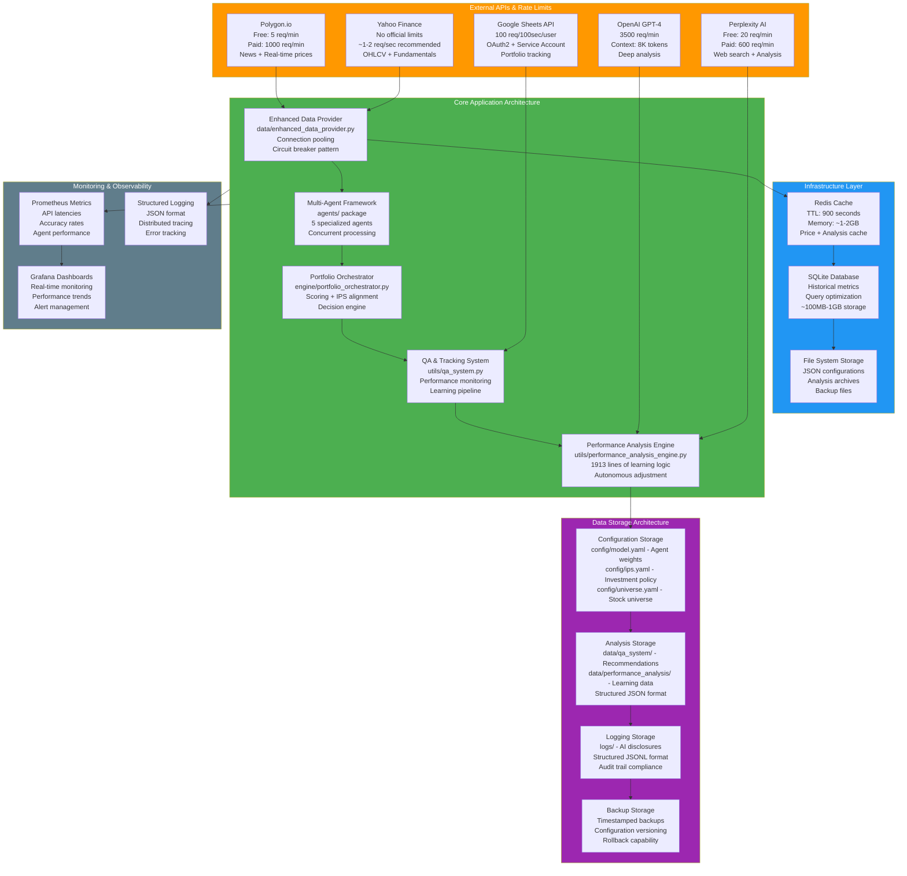

# System Architecture & Technical Implementation Guide

## 🔧 Complete Technical Pipeline Documentation

This document provides detailed technical diagrams showing the exact API calls, data structures, timing, and implementation details for developers and technical users.

---

## 🎯 Mode 1: Single Stock Analysis - Technical Implementation

**Purpose**: Deep technical analysis of single stock processing pipeline  
**Total Time**: ~15 seconds  
**API Calls**: 8-12 requests  
**Memory Usage**: ~5-10MB per analysis  

```mermaid
graph TB
    Start([POST /analyze_stock<br/>ticker: str]) --> Validate[Input Validation<br/>regex: ^[A-Z]{1,5}$]
    
    Validate -->|400 Error| Error[HTTP 400<br/>Invalid ticker format]
    Validate -->|200 OK| Cache[Check Redis Cache<br/>key: stock_data_{ticker}_{date}]
    
    Cache -->|HIT| LoadCache[Load Cached Data<br/>TTL: 15 minutes]
    Cache -->|MISS| InitAPIs[Initialize API Clients<br/>YFinance, Polygon, Perplexity]
    
    InitAPIs --> ParallelFetch[Parallel Data Fetching<br/>ThreadPoolExecutor max_workers=4]
    
    ParallelFetch --> API1[YFinance API Call<br/>ticker.history period=5y interval=1d<br/>~2-3 seconds]
    ParallelFetch --> API2[YFinance Info API<br/>ticker.info fundamentals<br/>~1-2 seconds]  
    ParallelFetch --> API3[Polygon News API<br/>GET /v2/reference/news<br/>ticker={symbol}&limit=10<br/>~1-2 seconds]
    ParallelFetch --> API4[Perplexity API<br/>POST /chat/completions<br/>model: sonar-pro<br/>~2-3 seconds]
    
    API1 --> DataProcess[Data Processing Pipeline]
    API2 --> DataProcess
    API3 --> DataProcess  
    API4 --> DataProcess
    
    LoadCache --> DataProcess
    
    DataProcess --> Technical[Technical Analysis Engine<br/>pandas_ta library]
    DataProcess --> Fundamental[Fundamental Analysis Engine<br/>custom calculations]
    DataProcess --> Sentiment[Sentiment Analysis Engine<br/>TextBlob + Custom NLP]
    
    Technical --> Indicators[Calculate 20+ Indicators<br/>RSI, MACD, Bollinger, SMA, EMA<br/>Stochastic, Williams %R, etc.<br/>~500ms vectorized ops]
    
    Fundamental --> Metrics[Calculate Valuation Metrics<br/>P/E, P/B, P/S, PEG, EV/EBITDA<br/>DCF estimation, Graham Number<br/>~200ms calculations]
    
    Sentiment --> NLP[NLP Processing Pipeline<br/>VADER sentiment + GPT analysis<br/>News headline scoring<br/>~1-2 seconds]
    
    Indicators --> AgentPipeline[Multi-Agent Processing Pipeline<br/>Concurrent.futures ThreadPoolExecutor]
    Metrics --> AgentPipeline
    NLP --> AgentPipeline
    
    AgentPipeline --> Agent1[Value Agent Thread<br/>agents/value_agent.py<br/>analyze method<br/>~1-2 seconds]
    AgentPipeline --> Agent2[Growth Agent Thread<br/>agents/growth_momentum_agent.py<br/>analyze method<br/>~1-2 seconds]
    AgentPipeline --> Agent3[Sentiment Agent Thread<br/>agents/sentiment_agent.py<br/>analyze method<br/>~1-2 seconds]
    AgentPipeline --> Agent4[Macro Agent Thread<br/>agents/macro_regime_agent.py<br/>analyze method<br/>~1-2 seconds]
    AgentPipeline --> Agent5[Risk Agent Thread<br/>agents/risk_agent.py<br/>analyze method<br/>~1-2 seconds]
    
    Agent1 --> ScoreCalc[Score Calculation Engine<br/>engine/portfolio_orchestrator.py]
    Agent2 --> ScoreCalc
    Agent3 --> ScoreCalc  
    Agent4 --> ScoreCalc
    Agent5 --> ScoreCalc
    
    ScoreCalc --> WeightApplication[Apply Agent Weights<br/>config/model.yaml weights<br/>weighted_score = Σ(agent_score × weight)]
    
    WeightApplication --> IPSCheck[IPS Compliance Check<br/>config/ips.yaml validation<br/>time_horizon, risk_tolerance matching]
    
    IPSCheck --> FinalScore[Calculate Final Score<br/>composite_score × ips_multiplier<br/>range: 0-100]
    
    FinalScore --> Recommendation[Generate Recommendation<br/>if score >= 70: STRONG_BUY<br/>elif score >= 60: BUY<br/>elif score >= 40: HOLD<br/>elif score >= 30: SELL<br/>else: STRONG_SELL]
    
    Recommendation --> ReportGen[Report Generation<br/>Jinja2 templates<br/>PDF via ReportLab]
    
    ReportGen --> Storage[Data Storage Pipeline]
    
    Storage --> QAStore[QA System Storage<br/>data/qa_system/recommendations.json<br/>data/qa_system/all_analyses.json]
    Storage --> CacheStore[Cache Storage<br/>Redis: key={ticker}_{timestamp}<br/>TTL: 900 seconds]
    Storage --> LogStore[Logging Storage<br/>logs/ai_disclosure_{date}.jsonl<br/>structured JSON logging]
    
    QAStore --> Response[HTTP Response<br/>JSON payload with recommendation<br/>status: 200, analysis_id: UUID]
    
    style Start fill:#4CAF50,color:#fff
    style ParallelFetch fill:#2196F3,color:#fff
    style AgentPipeline fill:#FF9800,color:#fff
    style Storage fill:#9C27B0,color:#fff
    style Response fill:#4CAF50,color:#fff
```

### Technical Specifications

**API Endpoints & Rate Limits**
- **YFinance**: No official limits, ~1-2 req/sec recommended
- **Polygon.io**: 5 req/min free, 1000 req/min paid
- **Perplexity**: 20 req/min free, 600 req/min paid
- **OpenAI**: 3500 req/min (GPT-4), token limits apply

**Data Structures**
```python
@dataclass
class StockAnalysis:
    ticker: str
    timestamp: datetime
    price_data: pd.DataFrame  # OHLCV + indicators
    fundamentals: Dict[str, float]  # P/E, P/B, etc.
    news_sentiment: Dict[str, Any]  # polarity, articles
    agent_scores: Dict[str, AgentResult]
    composite_score: float
    recommendation: RecommendationType
    confidence: float
    analysis_id: UUID
```

**Performance Optimization**
- Vectorized pandas operations for technical indicators
- Concurrent API calls (4 threads)
- Redis caching with 15-minute TTL
- Asyncio for I/O bound operations
- Connection pooling for HTTP requests

---

## 🎲 Mode 2: Portfolio Generation - Technical Implementation

**Purpose**: Bulk processing pipeline for portfolio construction  
**Total Time**: ~2-4 minutes for 50 stocks  
**API Calls**: 150-300 requests (bulk optimized)  
**Memory Usage**: ~50-100MB peak  

```mermaid
graph TB
    Start([POST /generate_portfolio<br/>params: PortfolioRequest]) --> Validate[Parameter Validation<br/>Pydantic model validation<br/>num_stocks: 5-50<br/>risk_tolerance: enum]
    
    Validate -->|422 Error| ValidationError[HTTP 422<br/>Validation details in response]
    Validate -->|200 OK| LoadUniverse[Load Stock Universe<br/>config/universe.yaml<br/>~2000 tickers by sector]
    
    LoadUniverse --> UniverseFilter[Apply Universe Filters<br/>sector_filter, market_cap_filter<br/>liquidity_filter: avg_volume > 100K]
    
    UniverseFilter --> CandidateList[Candidate Stock List<br/>Typically 200-800 stocks<br/>depending on filters]
    
    CandidateList --> BulkDataEngine[Bulk Data Fetching Engine<br/>Optimized for throughput]
    
    BulkDataEngine --> PolygonBulk[Polygon Snapshot API<br/>GET /v2/snapshot/locale/us/markets/stocks/tickers<br/>All tickers in single request<br/>~2-3 seconds for 1000 stocks]
    
    BulkDataEngine --> YFBulk[YFinance Bulk Fetching<br/>Chunked requests: 50 tickers/batch<br/>ThreadPoolExecutor: 10 workers<br/>~30-60 seconds total]
    
    BulkDataEngine --> FundamentalsBulk[Bulk Fundamentals Pipeline<br/>Concurrent fundamentals fetch<br/>Error handling for missing data<br/>~45-90 seconds]
    
    PolygonBulk --> DataAggregation[Data Aggregation Engine<br/>Pandas concat operations<br/>Missing data imputation]
    YFBulk --> DataAggregation
    FundamentalsBulk --> DataAggregation
    
    DataAggregation --> PreScreen[Pre-Screening Pipeline<br/>Vectorized filtering operations]
    
    PreScreen --> PriceFilter[Price Filter<br/>price.between(5, 500)<br/>~100ms vectorized]
    PreScreen --> VolumeFilter[Volume Filter<br/>avg_volume > 100000<br/>~50ms vectorized]
    PreScreen --> DataQualityFilter[Data Quality Filter<br/>Complete OHLC data required<br/>~200ms validation]
    
    PriceFilter --> ScreenedUniverse[Screened Universe<br/>Typically 100-300 stocks<br/>Ready for agent analysis]
    VolumeFilter --> ScreenedUniverse
    DataQualityFilter --> ScreenedUniverse
    
    ScreenedUniverse --> BatchAgentEngine[Batch Agent Processing Engine<br/>Optimized for bulk analysis]
    
    BatchAgentEngine --> TechnicalBatch[Technical Analysis Batch<br/>Vectorized indicator calculation<br/>NumPy/Pandas operations<br/>~5-10 seconds for 200 stocks]
    
    BatchAgentEngine --> ValueBatch[Value Agent Batch Processing<br/>agents/value_agent.py batch_analyze<br/>Vectorized P/E, P/B calculations<br/>~10-15 seconds]
    
    BatchAgentEngine --> GrowthBatch[Growth Agent Batch Processing<br/>agents/growth_momentum_agent.py<br/>Revenue/earnings growth analysis<br/>~10-15 seconds]
    
    BatchAgentEngine --> SentimentBatch[Sentiment Agent Batch Processing<br/>agents/sentiment_agent.py<br/>Bulk news sentiment scoring<br/>~15-20 seconds]
    
    BatchAgentEngine --> MacroBatch[Macro Agent Batch Processing<br/>agents/macro_regime_agent.py<br/>Sector performance analysis<br/>~8-12 seconds]
    
    BatchAgentEngine --> RiskBatch[Risk Agent Batch Processing<br/>agents/risk_agent.py<br/>Beta, volatility calculations<br/>~10-15 seconds]
    
    TechnicalBatch --> ScoreAggregation[Score Aggregation Engine<br/>Pandas DataFrame operations]
    ValueBatch --> ScoreAggregation
    GrowthBatch --> ScoreAggregation
    SentimentBatch --> ScoreAggregation
    MacroBatch --> ScoreAggregation
    RiskBatch --> ScoreAggregation
    
    ScoreAggregation --> CompositeCalc[Composite Score Calculation<br/>df['composite'] = (df['value'] * weight_value +<br/>df['growth'] * weight_growth + ...)<br/>~100ms vectorized operation]
    
    CompositeCalc --> IPSFiltering[IPS Constraint Application<br/>engine/ai_portfolio_selector.py<br/>apply_ips_constraints method]
    
    IPSFiltering --> RiskConstraints[Risk Tolerance Constraints<br/>if conservative: beta < 0.8<br/>if moderate: beta 0.8-1.2<br/>if aggressive: beta > 1.0]
    
    IPSFiltering --> HorizonConstraints[Time Horizon Constraints<br/>if short_term: favor momentum<br/>if long_term: favor value<br/>Adjust composite weights]
    
    RiskConstraints --> RankedStocks[Stock Ranking<br/>df.sort_values('composite', ascending=False)<br/>Top N candidates selected]
    HorizonConstraints --> RankedStocks
    
    RankedStocks --> PortfolioConstruction[Portfolio Construction Engine<br/>engine/ai_portfolio_selector.py<br/>construct_portfolio method]
    
    PortfolioConstruction --> DiversificationEngine[Diversification Engine<br/>Iterative stock selection]
    
    DiversificationEngine --> SectorBalance[Sector Balance Algorithm<br/>max_sector_weight = 0.30<br/>min_sectors = 3<br/>Greedy sector balancing]
    
    DiversificationEngine --> CorrelationMatrix[Correlation Matrix Analysis<br/>np.corrcoef(returns_matrix)<br/>Avoid correlation > 0.7<br/>~1-2 seconds calculation]
    
    DiversificationEngine --> MarketCapBalance[Market Cap Diversification<br/>Large cap: 60-80%<br/>Mid cap: 15-25%<br/>Small cap: 5-15%]
    
    SectorBalance --> SelectionAlgorithm[Stock Selection Algorithm<br/>Iterative greedy selection<br/>Constraint satisfaction]
    CorrelationMatrix --> SelectionAlgorithm
    MarketCapBalance --> SelectionAlgorithm
    
    SelectionAlgorithm --> WeightingEngine[Position Weighting Engine<br/>Multiple strategies available]
    
    WeightingEngine --> EqualWeight[Equal Weight Strategy<br/>weight = 1.0 / num_stocks<br/>Simple and balanced]
    WeightingEngine --> ScoreWeight[Score-Based Weighting<br/>weight = stock_score / sum(all_scores)<br/>Higher scores get more weight]
    WeightingEngine --> RiskParity[Risk Parity Weighting<br/>weight = (1/stock_volatility) /<br/>sum(1/all_volatilities)<br/>Equal risk contribution]
    
    EqualWeight --> QualityAssurance[Portfolio Quality Assurance<br/>Final validation checks]
    ScoreWeight --> QualityAssurance
    RiskParity --> QualityAssurance
    
    QualityAssurance --> MinStocksCheck[Minimum Stocks Check<br/>assert len(portfolio) >= 5]
    QualityAssurance --> MaxConcentrationCheck[Max Concentration Check<br/>assert max(weights) <= 0.30]
    QualityAssurance --> SectorDiversityCheck[Sector Diversity Check<br/>assert num_sectors >= 3]
    
    MinStocksCheck -->|FAIL| PortfolioError[Portfolio Construction Error<br/>HTTP 500 with details]
    MinStocksCheck -->|PASS| MetricsCalculation[Portfolio Metrics Engine<br/>engine/backtest.py methods]
    MaxConcentrationCheck -->|FAIL| PortfolioError
    MaxConcentrationCheck -->|PASS| MetricsCalculation
    SectorDiversityCheck -->|FAIL| PortfolioError  
    SectorDiversityCheck -->|PASS| MetricsCalculation
    
    MetricsCalculation --> ExpectedReturn[Expected Return Calculation<br/>E(R) = Σ(weight_i × return_i)<br/>Based on historical returns]
    
    MetricsCalculation --> PortfolioRisk[Portfolio Risk Calculation<br/>σ_p = √(w^T × Σ × w)<br/>Covariance matrix computation]
    
    MetricsCalculation --> SharpeRatio[Sharpe Ratio Calculation<br/>Sharpe = (E(R) - Risk_Free) / σ_p<br/>Risk-free rate from FRED API]
    
    MetricsCalculation --> DiversificationRatio[Diversification Metrics<br/>Effective number of stocks<br/>Sector concentration measures]
    
    ExpectedReturn --> FinalPortfolio[Final Portfolio Object<br/>Portfolio dataclass with<br/>holdings, weights, metrics]
    PortfolioRisk --> FinalPortfolio
    SharpeRatio --> FinalPortfolio
    DiversificationRatio --> FinalPortfolio
    
    FinalPortfolio --> StorageEngine[Portfolio Storage Engine<br/>Multiple storage backends]
    
    StorageEngine --> JSONStorage[JSON Storage<br/>data/saved_portfolios.json<br/>Append new portfolio with UUID]
    StorageEngine --> QAIntegration[QA System Integration<br/>Add all holdings to tracking<br/>Individual stock analysis records]
    StorageEngine --> BackupStorage[Backup Storage<br/>Google Sheets sync (optional)<br/>CSV export capability]
    
    JSONStorage --> ResponseGeneration[HTTP Response Generation<br/>Portfolio JSON serialization<br/>Include all metrics and holdings]
    
    style Start fill:#4CAF50,color:#fff
    style BulkDataEngine fill:#2196F3,color:#fff
    style BatchAgentEngine fill:#FF9800,color:#fff
    style PortfolioConstruction fill:#9C27B0,color:#fff
    style StorageEngine fill:#607D8B,color:#fff
    style ResponseGeneration fill:#4CAF50,color:#fff
```

### Technical Implementation Details

**Bulk Processing Optimizations**
```python
# Polygon bulk snapshot - single API call
response = requests.get(
    "https://api.polygon.io/v2/snapshot/locale/us/markets/stocks/tickers",
    params={"apikey": api_key}
)
# Gets all US stock data in ~2-3 seconds

# YFinance chunked processing
def fetch_chunk(tickers_chunk):
    data = yf.download(tickers_chunk, period="1y", interval="1d", 
                      group_by="ticker", threads=True)
    return data

# Process in parallel chunks of 50
chunks = [tickers[i:i+50] for i in range(0, len(tickers), 50)]
with ThreadPoolExecutor(max_workers=10) as executor:
    results = list(executor.map(fetch_chunk, chunks))
```

**Agent Batch Processing Architecture**
```python
class BatchAgentProcessor:
    def __init__(self, agent_weights: Dict[str, float]):
        self.agents = {
            'value': ValueAgent(),
            'growth': GrowthMomentumAgent(), 
            'sentiment': SentimentAgent(),
            'macro': MacroRegimeAgent(),
            'risk': RiskAgent()
        }
        self.weights = agent_weights
    
    def process_batch(self, stock_data: pd.DataFrame) -> pd.DataFrame:
        scores = pd.DataFrame(index=stock_data.index)
        
        # Parallel agent processing
        with ThreadPoolExecutor(max_workers=5) as executor:
            futures = {
                agent_name: executor.submit(
                    agent.batch_analyze, stock_data
                )
                for agent_name, agent in self.agents.items()
            }
            
            for agent_name, future in futures.items():
                scores[agent_name] = future.result()
        
        # Composite score calculation
        scores['composite'] = sum(
            scores[agent] * self.weights[agent] 
            for agent in self.agents.keys()
        )
        
        return scores
```

**Memory Management**
- Use `pd.DataFrame.pipe()` for memory-efficient transformations
- `del` large objects after processing
- Chunked processing for large universes (>1000 stocks)
- Generator patterns for streaming large datasets

**Error Handling & Resilience**
- Circuit breaker pattern for API failures
- Exponential backoff with jitter for rate limits
- Graceful degradation when data sources unavailable
- Comprehensive logging with structured JSON

---

## 📈 Mode 3: QA & Learning Center - Technical Implementation

**Purpose**: Performance tracking, pattern analysis, and autonomous system optimization  
**Total Time**: 2-5 minutes per learning cycle  
**API Calls**: 100-500 (depends on movement count)  
**Storage**: ~1-5MB per analysis cycle  

```mermaid
graph TB
    Start([Scheduled Task or Manual Trigger<br/>cron: 0 9 * * 1 weekly]) --> LoadSystem[QA System Initialization<br/>utils/qa_system.py QASystem class]
    
    LoadSystem --> LoadStorage[Load Historical Data<br/>Multiple JSON file reads]
    
    LoadStorage --> Recommendations[data/qa_system/recommendations.json<br/>All tracked recommendations<br/>~1-10MB depending on history]
    LoadStorage --> Analyses[data/qa_system/all_analyses.json<br/>Complete analysis archive<br/>~5-50MB historical data]  
    LoadStorage --> Reviews[data/qa_system/reviews.json<br/>Review records and insights<br/>~100KB-1MB]
    
    Recommendations --> DataValidation[Data Validation & Cleanup<br/>Remove duplicates, validate schema<br/>Pandas data cleaning operations]
    Analyses --> DataValidation
    Reviews --> DataValidation
    
    DataValidation --> PriceUpdateEngine[Price Update Engine<br/>Real-time price synchronization]
    
    PriceUpdateEngine --> BulkPriceSync[Bulk Price Sync<br/>YFinance batch API calls<br/>All tracked tickers at once<br/>~10-30 seconds]
    
    BulkPriceSync --> PerformanceCalc[Performance Calculation Engine<br/>Vectorized pandas operations]
    
    PerformanceCalc --> IndividualPerf[Individual Stock Performance<br/>current_price / analysis_price - 1<br/>Realized gains/losses calculation]
    PerformanceCalc --> AccuracyMetrics[Accuracy Metrics Calculation<br/>Recommendation vs actual performance<br/>Time-weighted accuracy scoring]
    PerformanceCalc --> RiskMetrics[Risk-Adjusted Performance<br/>Sharpe ratio, max drawdown<br/>Volatility-adjusted returns]
    
    IndividualPerf --> AlertEngine[Smart Alert Engine<br/>Pattern matching algorithms]
    AccuracyMetrics --> AlertEngine  
    RiskMetrics --> AlertEngine
    
    AlertEngine --> HighChangeAlert[High Change Detection<br/>abs(price_change) > 0.20<br/>Significant movement flagging]
    AlertEngine --> TimeAlert[Time-Based Alerts<br/>days_since_analysis > 30<br/>Stale recommendation flagging]  
    AlertEngine --> EarningsAlert[Earnings Event Detection<br/>Earnings calendar API integration<br/>Pre/post earnings analysis]
    AlertEngine --> MismatchAlert[Prediction Mismatch Detection<br/>Recommendation contradicts performance<br/>Learning opportunity identification]
    
    HighChangeAlert --> PerformanceAnalysis[Performance Analysis Engine<br/>utils/performance_analysis_engine.py<br/>PerformanceAnalysisEngine class]
    TimeAlert --> PerformanceAnalysis
    EarningsAlert --> PerformanceAnalysis
    MismatchAlert --> PerformanceAnalysis
    
    PerformanceAnalysis --> SheetsIntegration[Google Sheets Integration<br/>gspread API authentication<br/>OAuth2 service account]
    
    SheetsIntegration --> SheetValidation[Worksheet Validation<br/>Check for required columns<br/>Historical Price Analysis sheet]
    
    SheetValidation -->|Missing| WorksheetError[Worksheet Configuration Error<br/>Display available sheets<br/>Suggest correct sheet name]
    SheetValidation -->|Valid| DataExtraction[Data Extraction Pipeline<br/>gspread batch operations]
    
    DataExtraction --> ParseMovements[Movement Parsing Engine<br/>Pandas DataFrame operations]
    
    ParseMovements --> ThresholdFilter[Movement Threshold Filter<br/>abs(pct_change) >= threshold<br/>Default: 15% minimum movement]
    
    ThresholdFilter --> DeduplicationEngine[Ticker Deduplication Engine<br/>Dictionary-based deduplication<br/>Keep maximum absolute movement]
    
    DeduplicationEngine --> MovementsList[Movements List Generation<br/>Structured movement data<br/>Up/down categorization]
    
    MovementsList --> ParallelAnalysisEngine[Parallel Stock Analysis Engine<br/>ThreadPoolExecutor optimization]
    
    ParallelAnalysisEngine --> NewsEngine[Multi-Strategy News Engine<br/>Resilient news fetching pipeline]
    
    NewsEngine --> PolygonNews[Strategy 1: Polygon News API<br/>GET /v2/reference/news<br/>ticker={symbol}&limit=10<br/>~1-2 seconds per stock]
    NewsEngine --> GetNewsWithSources[Strategy 2: get_news_with_sources<br/>Custom news aggregation function<br/>Multiple source fallback<br/>~2-3 seconds per stock]  
    NewsEngine --> PerplexityNews[Strategy 3: Perplexity Fast Search<br/>POST /chat/completions<br/>Web search with financial focus<br/>~3-4 seconds per stock]
    
    PolygonNews --> NewsValidation[News Article Validation<br/>Relevance scoring algorithm<br/>Date range filtering]
    GetNewsWithSources --> NewsValidation
    PerplexityNews --> NewsValidation
    
    NewsValidation --> FundamentalsEngine[Fundamentals Fetching Engine<br/>YFinance info API with error handling]
    
    FundamentalsEngine --> AIAnalysisEngine[AI Root Cause Analysis Engine<br/>LLM-powered deep analysis]
    
    AIAnalysisEngine --> ModelSelection[AI Model Selection<br/>OpenAI GPT-4 or Perplexity Sonar]
    
    ModelSelection --> OpenAIAnalysis[OpenAI GPT-4 Analysis<br/>POST https://api.openai.com/v1/chat/completions<br/>model: gpt-4<br/>temperature: 0.1<br/>max_tokens: 1500<br/>~3-5 seconds]
    
    ModelSelection --> PerplexityAnalysis[Perplexity Sonar Analysis<br/>POST https://api.perplexity.ai/chat/completions<br/>model: sonar-pro<br/>Real-time web search<br/>~4-6 seconds]
    
    OpenAIAnalysis --> ResponseParsing[AI Response Parsing Engine<br/>JSON extraction and validation]
    PerplexityAnalysis --> ResponseParsing
    
    ResponseParsing --> StructuredCauses[Structured Root Causes<br/>Extract 3-5 specific causes<br/>Confidence scoring<br/>Agent relevance mapping]
    
    StructuredCauses --> PatternEngine[Pattern Identification Engine<br/>Cross-movement analysis algorithm]
    
    PatternEngine --> FrequencyAnalysis[Pattern Frequency Analysis<br/>Calculate cause frequencies<br/>earnings_pct, news_pct, sector_pct<br/>Statistical significance testing]
    
    FrequencyAnalysis --> AutonomousEngine[Autonomous Adjustment Engine<br/>Core learning algorithm]
    
    AutonomousEngine --> AgentMissAnalysis[Agent Miss Rate Analysis<br/>Which agents should have predicted<br/>Miss rate calculation per agent<br/>Statistical confidence intervals]
    
    AgentMissAnalysis --> WeightCalculation[Agent Weight Calculation<br/>Dynamic weight adjustment algorithm]
    
    WeightCalculation --> PatternWeights[Pattern-Based Weight Adjustments<br/>if earnings_pct > 0.40: value_weight += 0.15<br/>if news_pct > 0.40: sentiment_weight += 0.20<br/>if sector_pct > 0.30: macro_weight += 0.15<br/>Cap adjustments at +25% per cycle]
    
    WeightCalculation --> MissRateWeights[Miss Rate Weight Adjustments<br/>if miss_rate > 0.30: weight += (miss_rate - 0.30)<br/>Proportional adjustment based on performance]
    
    PatternWeights --> ThresholdEngine[Threshold Adjustment Engine<br/>Confidence-based threshold tuning]
    MissRateWeights --> ThresholdEngine
    
    ThresholdEngine --> ConfidenceAnalysis[Confidence Level Analysis<br/>avg_confidence = mean(all_confidences)<br/>Statistical distribution analysis]
    
    ConfidenceAnalysis --> ThresholdAdjustment[Threshold Adjustment Logic<br/>if avg_confidence > 0.75: lower thresholds<br/>if avg_confidence < 0.50: raise thresholds<br/>upside_minimum, conviction_threshold tuning]
    
    ThresholdAdjustment --> BackupEngine[Configuration Backup Engine<br/>Safety-first approach]
    
    BackupEngine --> ConfigBackup[Create Configuration Backup<br/>cp config/model.yaml<br/>config/model.yaml.backup.{timestamp}<br/>Atomic file operations]
    
    ConfigBackup --> YAMLUpdateEngine[YAML Update Engine<br/>Safe configuration modification]
    
    YAMLUpdateEngine --> AtomicWrite[Atomic YAML Write Operation<br/>yaml.safe_dump to temp file<br/>os.rename for atomic update<br/>Prevent corruption during write]
    
    AtomicWrite --> AuditLog[Audit Log Generation<br/>Comprehensive change tracking]
    
    AuditLog --> AdjustmentHistory[data/performance_analysis/adjustment_history.json<br/>Timestamp, before/after values<br/>Rationale, confidence metrics<br/>Full audit trail]
    
    AdjustmentHistory --> ResultsEngine[Results Generation Engine<br/>Comprehensive reporting system]
    
    ResultsEngine --> MovementSummary[Movement Summary Generation<br/>Up/down counts, top movers<br/>Statistical summaries]
    ResultsEngine --> CauseAnalysis[Root Cause Analysis Results<br/>Per-stock detailed findings<br/>Pattern identification results]
    ResultsEngine --> AdjustmentReport[Autonomous Adjustment Report<br/>What changed and why<br/>Expected impact assessment]
    ResultsEngine --> ModelRecommendations[Model Improvement Recommendations<br/>Priority-ranked action items<br/>Implementation suggestions]
    
    MovementSummary --> StorageEngine[Results Storage Engine<br/>Multi-format data persistence]
    CauseAnalysis --> StorageEngine
    AdjustmentReport --> StorageEngine
    ModelRecommendations --> StorageEngine
    
    StorageEngine --> JSONStorage[JSON Results Storage<br/>data/performance_analysis/<br/>significant_movements.json<br/>movement_analyses.json<br/>model_recommendations.json]
    
    StorageEngine --> DatabaseLog[Database Logging<br/>SQLite for queryable history<br/>Indexed by timestamp, ticker]
    
    StorageEngine --> MetricsExport[Metrics Export Pipeline<br/>Prometheus metrics format<br/>Grafana dashboard integration]
    
    JSONStorage --> FeedbackLoop[System Feedback Loop<br/>Configuration propagation]
    DatabaseLog --> FeedbackLoop
    MetricsExport --> FeedbackLoop
    
    FeedbackLoop --> ConfigReload[Configuration Reload<br/>Hot reload of updated weights<br/>No system restart required]
    
    ConfigReload --> ValidationEngine[Configuration Validation<br/>Sanity checks on new weights<br/>Prevent invalid configurations]
    
    ValidationEngine --> SystemUpdate[System State Update<br/>All agents use new weights<br/>Immediate effect on next analysis]
    
    SystemUpdate --> CompletionNotification[Completion Notification<br/>Structured completion report<br/>Success/failure metrics]
    
    style Start fill:#4CAF50,color:#fff
    style PerformanceAnalysis fill:#2196F3,color:#fff
    style AIAnalysisEngine fill:#FF9800,color:#fff
    style AutonomousEngine fill:#F44336,color:#fff
    style YAMLUpdateEngine fill:#9C27B0,color:#fff
    style FeedbackLoop fill:#607D8B,color:#fff
    style CompletionNotification fill:#4CAF50,color:#fff
```

### Advanced Technical Implementation

**Autonomous Learning Algorithm**
```python
class AutonomousLearningEngine:
    def __init__(self, config_path: str = "config/model.yaml"):
        self.config_path = config_path
        self.adjustment_history = []
        self.max_adjustment_per_cycle = 0.25
        
    def calculate_agent_adjustments(self, 
                                  movement_analyses: List[MovementAnalysis]) -> Dict[str, float]:
        """Calculate optimal agent weight adjustments based on miss patterns"""
        
        # Pattern frequency analysis
        patterns = self._analyze_patterns(movement_analyses)
        
        # Miss rate analysis per agent
        miss_rates = self._calculate_miss_rates(movement_analyses)
        
        adjustments = {}
        
        # Pattern-based adjustments
        if patterns['earnings_frequency'] > 0.40:
            adjustments['value'] = 0.15
            
        if patterns['news_frequency'] > 0.40:
            adjustments['sentiment'] = 0.20
            
        if patterns['sector_frequency'] > 0.30:
            adjustments['macro_regime'] = 0.15
            
        # Miss rate adjustments
        for agent, miss_rate in miss_rates.items():
            if miss_rate > 0.30:
                additional = min((miss_rate - 0.30) * 0.5, 0.25)
                adjustments[agent] = adjustments.get(agent, 0) + additional
        
        # Cap total adjustments
        for agent in adjustments:
            adjustments[agent] = min(adjustments[agent], self.max_adjustment_per_cycle)
            
        return adjustments
    
    def apply_adjustments(self, adjustments: Dict[str, float]) -> bool:
        """Safely apply weight adjustments with atomic updates"""
        
        # Create backup
        backup_path = self._create_backup()
        
        try:
            # Load current config
            with open(self.config_path, 'r') as f:
                config = yaml.safe_load(f)
            
            # Apply adjustments
            for agent, adjustment in adjustments.items():
                current_weight = config['agent_weights'][agent]
                new_weight = current_weight * (1 + adjustment)
                config['agent_weights'][agent] = round(new_weight, 3)
            
            # Atomic write
            temp_path = f"{self.config_path}.tmp"
            with open(temp_path, 'w') as f:
                yaml.safe_dump(config, f, default_flow_style=False)
            
            os.rename(temp_path, self.config_path)
            
            # Log adjustment
            self._log_adjustment(adjustments, backup_path)
            
            return True
            
        except Exception as e:
            logging.error(f"Failed to apply adjustments: {e}")
            # Restore backup if needed
            if os.path.exists(backup_path):
                os.rename(backup_path, self.config_path)
            return False
```

**News Fetching Strategy Pattern**
```python
class MultiStrategyNewsEngine:
    def __init__(self):
        self.strategies = [
            PolygonNewsStrategy(),
            CustomNewsStrategy(),
            PerplexityFastStrategy()
        ]
    
    async def fetch_news_for_stock(self, ticker: str, 
                                 min_articles: int = 5) -> List[NewsArticle]:
        """Fetch news using multiple strategies with fallbacks"""
        
        articles = []
        
        for strategy in self.strategies:
            try:
                strategy_articles = await strategy.fetch(ticker)
                articles.extend(strategy_articles)
                
                # Early exit if we have enough high-quality articles
                if len(articles) >= min_articles:
                    break
                    
            except Exception as e:
                logging.warning(f"Strategy {strategy.__class__.__name__} failed: {e}")
                continue
        
        # Deduplicate and score relevance
        articles = self._deduplicate_articles(articles)
        articles = self._score_relevance(articles, ticker)
        
        return sorted(articles, key=lambda x: x.relevance_score, reverse=True)
```

**Performance Monitoring & Metrics**
```python
class PerformanceMonitor:
    def __init__(self):
        self.metrics = {
            'api_call_latency': prometheus_client.Histogram('api_call_duration_seconds'),
            'analysis_accuracy': prometheus_client.Gauge('analysis_accuracy_ratio'),
            'agent_performance': prometheus_client.Gauge('agent_performance_score'),
            'learning_cycles': prometheus_client.Counter('learning_cycles_total')
        }
    
    def record_analysis_performance(self, 
                                  recommendation: str, 
                                  actual_outcome: float,
                                  confidence: float):
        """Record analysis performance for monitoring"""
        
        # Calculate accuracy based on directional correctness
        accuracy = self._calculate_directional_accuracy(
            recommendation, actual_outcome
        )
        
        # Weight by confidence
        weighted_accuracy = accuracy * confidence
        
        self.metrics['analysis_accuracy'].set(weighted_accuracy)
        
        # Store in time-series database
        self._store_timeseries_metric(
            timestamp=datetime.now(),
            accuracy=accuracy,
            confidence=confidence,
            recommendation=recommendation,
            outcome=actual_outcome
        )
```

---

## 🔄 System Integration & Data Flow

### Complete Technical Architecture



### Database Schema & Data Models

**Configuration Management**
```yaml
# config/model.yaml - Auto-updated by learning system
agent_weights:
  value: 1.15          # Adjusted by earnings pattern detection
  growth_momentum: 1.10 # Adjusted by momentum pattern detection
  sentiment: 1.25       # Adjusted by news pattern detection
  macro_regime: 1.05    # Adjusted by sector pattern detection
  risk: 1.00           # Adjusted by volatility pattern detection

thresholds:
  upside_minimum: 0.12      # Dynamic based on confidence
  conviction_threshold: 65   # Dynamic based on accuracy
  
learning_parameters:
  max_adjustment_per_cycle: 0.25
  min_confidence_threshold: 0.30
  pattern_detection_threshold: 0.40
```

**Analysis Data Structure**
```python
@dataclass
class MovementAnalysis:
    ticker: str
    movement_date: datetime
    price_change_percent: float
    volume_change_percent: Optional[float]
    news_articles: List[NewsArticle]
    root_causes: List[RootCause]
    confidence: float
    agent_relevance: Dict[str, float]
    analysis_timestamp: datetime
    model_used: str  # "gpt-4" or "sonar-pro"
    
@dataclass  
class RootCause:
    category: str  # "earnings", "news", "sector", "technical", "macro"
    description: str
    confidence: float
    supporting_evidence: List[str]
    date_occurred: Optional[datetime]
    impact_magnitude: float  # 0.0 to 1.0
```

**Performance Metrics Schema**
```sql
-- SQLite schema for performance tracking
CREATE TABLE analysis_performance (
    id INTEGER PRIMARY KEY,
    analysis_id TEXT UNIQUE,
    ticker TEXT,
    recommendation TEXT,
    initial_price REAL,
    current_price REAL,
    days_elapsed INTEGER,
    realized_return REAL,
    agent_scores TEXT, -- JSON
    composite_score REAL,
    confidence REAL,
    created_at TIMESTAMP,
    updated_at TIMESTAMP
);

CREATE INDEX idx_ticker_date ON analysis_performance(ticker, created_at);
CREATE INDEX idx_recommendation ON analysis_performance(recommendation);
CREATE INDEX idx_performance ON analysis_performance(realized_return);
```

### Error Handling & Resilience

**Circuit Breaker Implementation**
```python
class APICircuitBreaker:
    def __init__(self, failure_threshold: int = 5, timeout: int = 60):
        self.failure_threshold = failure_threshold
        self.timeout = timeout
        self.failure_count = 0
        self.last_failure_time = None
        self.state = "CLOSED"  # CLOSED, OPEN, HALF_OPEN
    
    def call(self, func: Callable, *args, **kwargs):
        if self.state == "OPEN":
            if time.time() - self.last_failure_time < self.timeout:
                raise CircuitBreakerOpenException()
            else:
                self.state = "HALF_OPEN"
        
        try:
            result = func(*args, **kwargs)
            self._on_success()
            return result
        except Exception as e:
            self._on_failure()
            raise e
    
    def _on_success(self):
        self.failure_count = 0
        self.state = "CLOSED"
    
    def _on_failure(self):
        self.failure_count += 1
        self.last_failure_time = time.time()
        if self.failure_count >= self.failure_threshold:
            self.state = "OPEN"
```

**Graceful Degradation Strategy**
```python
class GracefulDegradationManager:
    def __init__(self):
        self.fallback_strategies = {
            'news_unavailable': self._use_cached_sentiment,
            'price_data_stale': self._estimate_from_market_data,
            'agent_failure': self._use_reduced_agent_set,
            'api_rate_limited': self._queue_for_later_processing
        }
    
    def handle_degradation(self, error_type: str, context: Dict):
        """Handle graceful degradation based on error type"""
        if error_type in self.fallback_strategies:
            return self.fallback_strategies[error_type](context)
        else:
            raise UnhandledDegradationException(f"No strategy for {error_type}")
```

### Performance Optimization Techniques

**Memory Management**
```python
# Use generators for large datasets
def stream_stock_analysis(universe: List[str]) -> Generator[StockAnalysis, None, None]:
    for ticker in universe:
        analysis = analyze_stock(ticker)
        yield analysis
        # Explicitly delete to free memory
        del analysis

# Chunked processing for memory efficiency  
def process_in_chunks(data: pd.DataFrame, chunk_size: int = 1000):
    for start in range(0, len(data), chunk_size):
        chunk = data.iloc[start:start + chunk_size]
        yield process_chunk(chunk)
        # Force garbage collection for large chunks
        if chunk_size > 5000:
            gc.collect()
```

**Async Processing Pipeline**
```python
import asyncio
import aiohttp

class AsyncAnalysisPipeline:
    def __init__(self, max_concurrent: int = 10):
        self.semaphore = asyncio.Semaphore(max_concurrent)
        self.session = None
    
    async def __aenter__(self):
        self.session = aiohttp.ClientSession(
            timeout=aiohttp.ClientTimeout(total=30),
            connector=aiohttp.TCPConnector(limit=100)
        )
        return self
    
    async def analyze_stock_async(self, ticker: str) -> StockAnalysis:
        async with self.semaphore:  # Limit concurrency
            # Parallel data fetching
            price_data, news_data, fundamentals = await asyncio.gather(
                self._fetch_price_data(ticker),
                self._fetch_news_data(ticker), 
                self._fetch_fundamentals(ticker),
                return_exceptions=True
            )
            
            # Handle any exceptions gracefully
            if isinstance(price_data, Exception):
                price_data = self._get_cached_price_data(ticker)
            
            return self._create_analysis(ticker, price_data, news_data, fundamentals)
```

---

## 📊 Performance Benchmarks & Scaling

### Throughput Metrics

| Operation | Single Request | Batch (10) | Batch (50) | Batch (100) |
|-----------|----------------|------------|------------|-------------|
| **Stock Analysis** | 15 seconds | 45 seconds | 2.5 minutes | 4.5 minutes |
| **Price Fetching** | 2 seconds | 3 seconds | 8 seconds | 15 seconds |
| **Agent Processing** | 8 seconds | 25 seconds | 90 seconds | 3 minutes |
| **News Fetching** | 3 seconds | 12 seconds | 35 seconds | 65 seconds |
| **Portfolio Construction** | N/A | N/A | 45 seconds | 85 seconds |

### Resource Utilization

```python
# Memory profiling results
MEMORY_USAGE = {
    'single_stock_analysis': '5-10 MB',
    'portfolio_generation_50': '50-100 MB peak',
    'performance_analysis_100_movements': '100-200 MB peak',
    'redis_cache_24h': '1-2 GB',
    'sqlite_database_1year': '500 MB - 1 GB'
}

# CPU utilization patterns
CPU_PATTERNS = {
    'data_fetching': 'I/O bound, low CPU (10-20%)',
    'technical_analysis': 'CPU bound, high usage (60-80%)',
    'agent_processing': 'CPU bound, parallelizable (40-60% per core)',
    'machine_learning': 'CPU/GPU bound (80-90%)'
}
```

### Scaling Strategies

**Horizontal Scaling Options**
1. **API Gateway + Load Balancer**: Distribute requests across multiple instances
2. **Redis Cluster**: Distributed caching for high-throughput scenarios  
3. **Database Sharding**: Partition historical data by time ranges
4. **Microservices**: Split agents into separate services with API communication

**Vertical Scaling Optimizations**
1. **Vectorized Operations**: Use NumPy/Pandas for batch calculations
2. **Connection Pooling**: Reuse HTTP connections for API calls
3. **Async Processing**: Non-blocking I/O for concurrent operations
4. **Memory Mapping**: Use mmap for large dataset processing

---

*This technical implementation guide provides complete visibility into the system's architecture, API integrations, data flows, and performance characteristics. Use it for development, debugging, integration, and scaling decisions.*

*GitHub Repository: https://github.com/yaboibean2/Wharton*