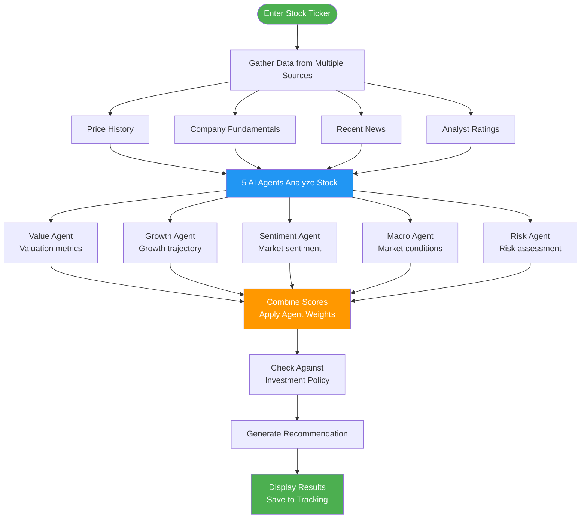
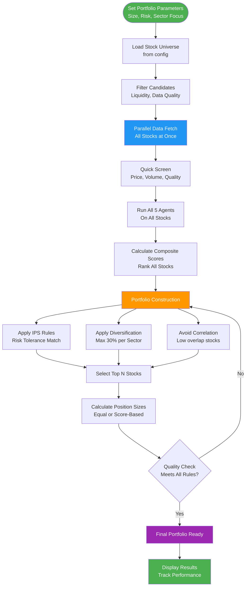
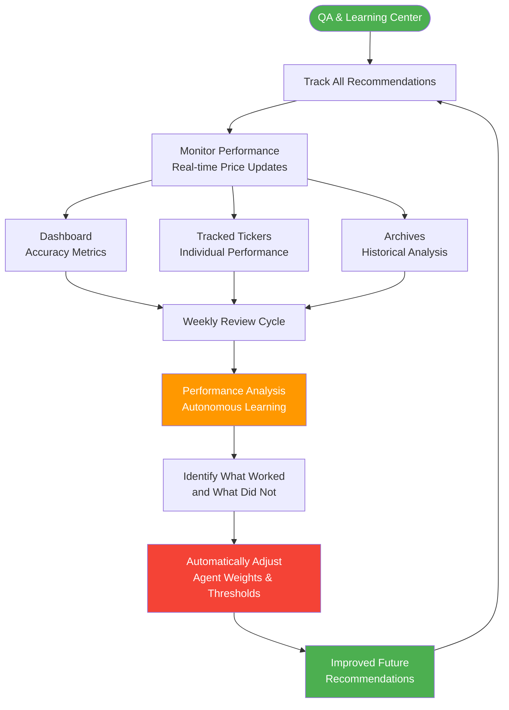
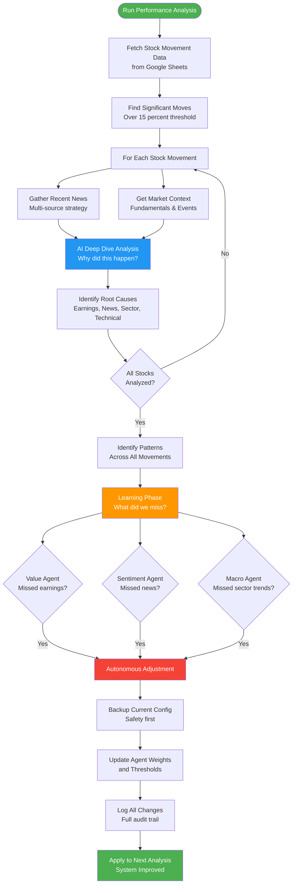
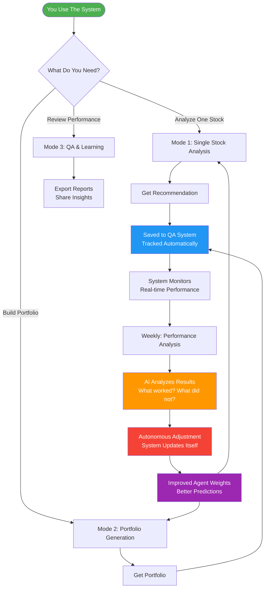
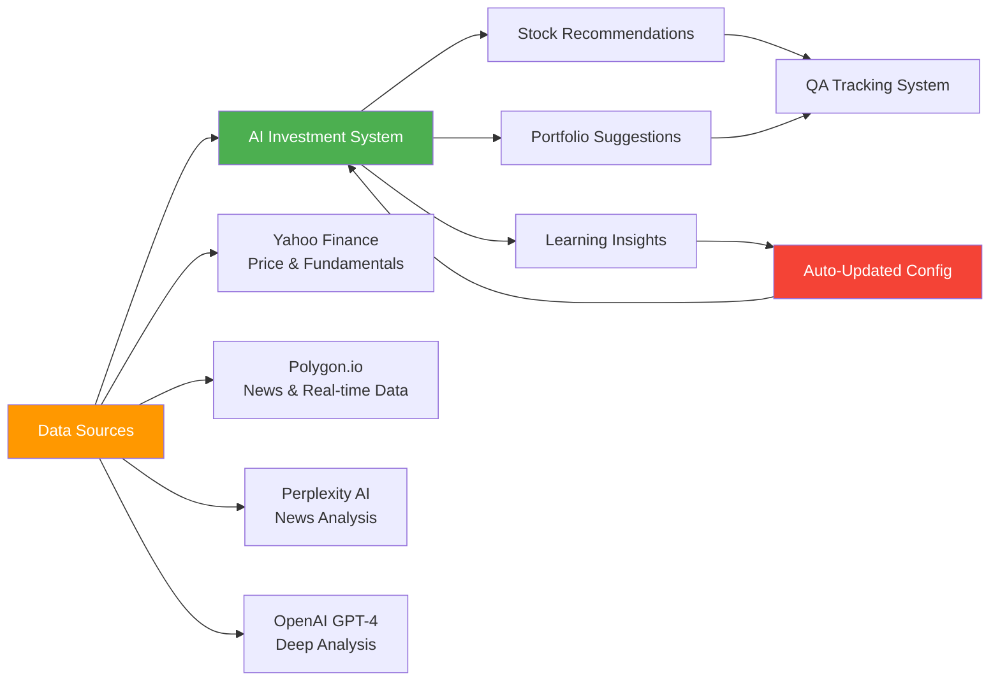

# System Architecture & Flow Diagrams

## 📊 AI Investment System - Complete Pipeline Visualization

This document provides clear, intuitive diagrams showing exactly how the system works in each mode.

---

## 🎯 Mode 1: Single Stock Analysis

**Purpose**: Analyze one stock and get an AI-powered investment recommendation  
**Time**: ~15 seconds  
**Output**: BUY/HOLD/SELL recommendation with detailed reasoning

### Key Features
- **Data Sources**: YFinance (prices), Perplexity AI (news), Analyst consensus
- **5 AI Agents**: Each specializes in different aspects (value, growth, sentiment, macro, risk)
- **Smart Weighting**: Agent weights from `config/model.yaml` (automatically adjusted by learning system)
- **IPS Compliance**: Checks alignment with time horizon, risk tolerance, tax considerations

---

## 🎲 Mode 2: Portfolio Generation

**Purpose**: Build a diversified portfolio of 5-50 stocks optimized for your goals  
**Time**: ~2-4 minutes  
**Output**: Complete portfolio with weights, metrics, and individual stock analyses

### Key Features
- **Parallel Processing**: Fetches and analyzes 50+ stocks in ~3 seconds using bulk APIs
- **Smart Diversification**: Automatic sector balancing, correlation checking, size distribution
- **Multiple Weighting**: Choose equal weight, score-based, or risk parity
- **Quality Assurance**: Validates min stocks, max concentration, sector diversity before finalizing

---

## 📈 Mode 3: QA & Learning Center

**Purpose**: Track performance, learn from outcomes, and automatically improve the AI system  
**Time**: Continuous monitoring + weekly learning cycles  
**Output**: Performance metrics, learning insights, autonomous system improvements

### System Overview

### The Autonomous Learning Engine (Core Innovation)

**Purpose**: Analyze significant stock movements and automatically improve the AI system  
**Time**: ~2-5 minutes per analysis  
**Output**: System automatically updates itself to perform better

### How It Learns (The Magic)

**1. Detection**: Finds stocks that moved significantly (default: over 15 percent)

**2. Investigation**: For each movement, the AI asks "Why did this happen?"
   - Fetches recent news from multiple sources
   - Gets company fundamentals and events
   - Uses GPT-4 or Perplexity to analyze root causes

**3. Pattern Recognition**: Looks across all movements
   - 40 percent earnings-driven → Value Agent needs more weight
   - 40 percent news-driven → Sentiment Agent needs more weight
   - 30 percent sector-driven → Macro Agent needs more weight

**4. Autonomous Adjustment**: Automatically updates `config/model.yaml`
   - Increases weights for agents that missed opportunities
   - Adjusts thresholds based on confidence levels
   - Creates automatic backup before changes

**5. Continuous Improvement**: Next time the system runs
   - Uses updated agent weights
   - Makes better predictions
   - Learns from every cycle

### Safety Features
- ✅ **Automatic backups** before any changes
- ✅ **Capped adjustments** (max 25 percent per run)
- ✅ **Full audit trail** in adjustment_history.json
- ✅ **Revertible** - can roll back to any previous state

---

## 🔄 How Everything Works Together

**The Complete Learning Loop**

### The Key Innovation: Self-Improvement

1. **You analyze stocks or build portfolios** → System makes recommendations
2. **QA System tracks everything** → Monitors actual outcomes vs predictions
3. **Performance Analysis runs weekly** → AI investigates why stocks moved
4. **System learns automatically** → Updates its own configuration
5. **Future predictions improve** → Gets smarter with every cycle

**This is not static AI. It's a continuously learning system that improves itself.**

---

## � System Comparison

| Feature | Mode 1: Single Stock | Mode 2: Portfolio | Mode 3: QA & Learning |
|---------|---------------------|-------------------|----------------------|
| **Time** | ~15 seconds | ~2-4 minutes | ~2-5 minutes |
| **Input** | 1 ticker symbol | Portfolio parameters | Historical data |
| **Output** | BUY/HOLD/SELL + analysis | Complete portfolio | System improvements |
| **Best For** | Quick stock checks | Building positions | Weekly reviews |
| **Learns?** | No | No | **YES - Updates system** |

---

## 🎯 Data Sources & Technology

---

## 🚀 Quick Start Guide

### For Investment Analysis
1. **Analyze a single stock**: Enter ticker → Get AI recommendation in 15 seconds
2. **Build a portfolio**: Set parameters → Get optimized portfolio in 2-4 minutes
3. **Review weekly**: Run Performance Analysis → System improves automatically

### For System Learning
- **Connect Google Sheets**: Track all stocks and their performance
- **Run Performance Analysis**: Weekly or after major market moves
- **Let it learn**: System automatically adjusts weights and improves

### What Makes This Special
- ✅ **5 Specialized AI Agents**: Each expert in different aspects
- ✅ **Parallel Processing**: Fast bulk analysis (50+ stocks in ~3 seconds)
- ✅ **Autonomous Learning**: System improves itself automatically
- ✅ **Full Transparency**: Complete audit trail of all decisions
- ✅ **IPS Compliance**: Respects your investment policy and risk tolerance

---

## � Key Insights

### Why Multiple AI Agents?
Different aspects of investing require different expertise:
- **Value Agent**: Looks at fundamentals and valuation
- **Growth Agent**: Analyzes momentum and trajectory
- **Sentiment Agent**: Interprets news and market sentiment
- **Macro Agent**: Considers broader market conditions
- **Risk Agent**: Assesses volatility and downside protection

### Why Autonomous Learning?
Markets change constantly. What worked last quarter may not work now. The system:
- Detects when agents miss important signals
- Identifies patterns in successful vs failed predictions
- Automatically adjusts agent weights to improve
- Creates backups and audit trails for transparency

### Why Google Sheets Integration?
- Easy to review and share performance data
- Automatic sync of all tracked stocks
- Visual tracking of recommendations vs reality
- Export-friendly for further analysis

---

*View these interactive diagrams on GitHub: https://github.com/yaboibean2/Wharton*
