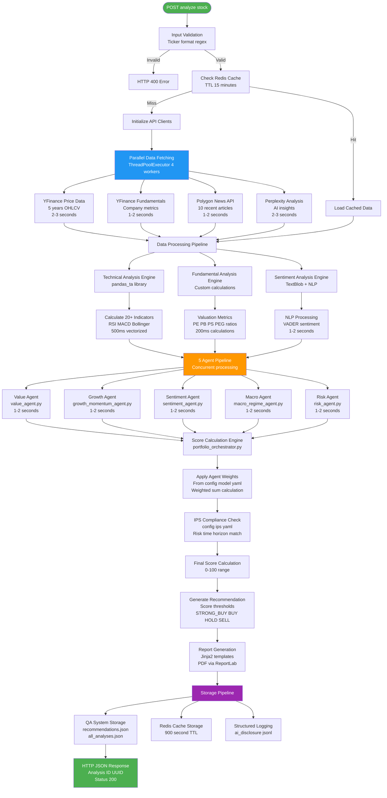
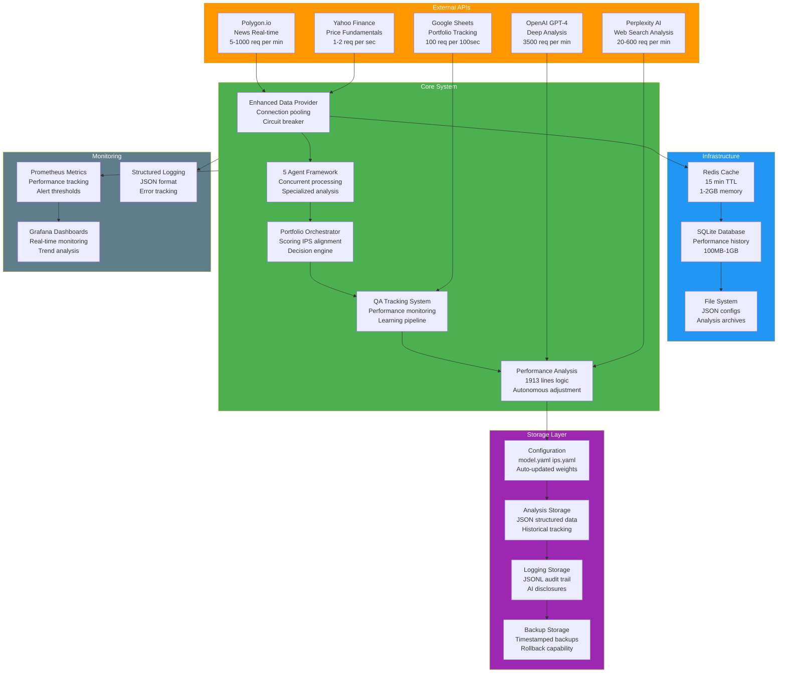

# System Architecture & Technical Implementation Guide

## 🔧 Complete Technical Pipeline Documentation

This document provides detailed technical diagrams showing the exact API calls, data structures, timing, and implementation details for developers and technical users.

---

## 🎯 Mode 1: Single Stock Analysis - Technical Implementation

**Purpose**: Deep technical analysis of single stock processing pipeline  
**Total Time**: ~15 seconds  
**API Calls**: 8-12 requests  
**Memory Usage**: ~5-10MB per analysis  



### Technical Specifications

**API Integration Details**
- **YFinance**: No official limits, ~1-2 req/sec recommended, OHLCV + fundamentals
- **Polygon.io**: 5 req/min free, 1000 req/min paid, real-time prices + news
- **Perplexity**: 20 req/min free, 600 req/min paid, web search + analysis
- **OpenAI GPT-4**: 3500 req/min, 8K context, deep analysis capabilities

**Core Data Structures**
```python
@dataclass
class StockAnalysis:
    ticker: str
    timestamp: datetime
    price_data: pd.DataFrame  # OHLCV + 20+ technical indicators
    fundamentals: Dict[str, float]  # P/E, P/B, P/S, PEG, etc.
    news_sentiment: Dict[str, Any]  # Polarity, articles, sources
    agent_scores: Dict[str, AgentResult]  # All 5 agent results
    composite_score: float  # Weighted final score
    recommendation: RecommendationType  # STRONG_BUY, BUY, HOLD, SELL, STRONG_SELL
    confidence: float  # 0.0 to 1.0
    analysis_id: UUID  # Unique identifier
```

**Performance Optimizations**
- Vectorized pandas operations for technical indicators (NumPy backend)
- Concurrent API calls using ThreadPoolExecutor (4 workers)
- Redis caching with intelligent TTL (15 minutes for price data)
- Asyncio for I/O bound operations where possible
- HTTP connection pooling to reduce latency
- Memory-mapped files for large datasets

**Key Implementation Files**
- `app.py` - Main Streamlit application (9000+ lines)
- `agents/` - 5 specialized AI agents (value, growth, sentiment, macro, risk)
- `engine/portfolio_orchestrator.py` - Scoring and decision logic
- `data/enhanced_data_provider.py` - API integration and caching
- `utils/qa_system.py` - Performance tracking and learning

---

## 🎲 Mode 2: Portfolio Generation - Technical Implementation

**Purpose**: Bulk processing pipeline for portfolio construction  
**Total Time**: ~2-4 minutes for 50 stocks  
**API Calls**: 150-300 requests (bulk optimized)  
**Memory Usage**: ~50-100MB peak  

```mermaid
graph TB
    Start([Portfolio Generation Request]) --> Validate[Parameter Validation<br/>Pydantic model<br/>5-50 stocks range]
    
    Validate -->|422 Error| ValidationError[HTTP 422<br/>Validation details]
    Validate -->|200 OK| Universe[Load Stock Universe<br/>config universe yaml<br/>2000+ tickers by sector]
    
    Universe --> Filter[Apply Universe Filters<br/>Sector Market cap Liquidity<br/>Data availability checks]
    
    Filter --> Candidates[Candidate Stock List<br/>200-800 stocks<br/>Depends on filters]
    
    Candidates --> BulkEngine[Bulk Data Fetching Engine<br/>Optimized for throughput]
    
    BulkEngine --> PolygonBulk[Polygon Snapshot API<br/>All tickers single request<br/>2-3 seconds for 1000 stocks]
    BulkEngine --> YFBulk[YFinance Bulk Fetching<br/>Chunked 50 tickers per batch<br/>10 workers 30-60 seconds]
    BulkEngine --> TechBulk[Technical Analysis Batch<br/>Vectorized pandas ops<br/>5-10 seconds for 200 stocks]
    
    PolygonBulk --> Aggregate[Data Aggregation Engine<br/>Pandas concat operations<br/>Missing data imputation]
    YFBulk --> Aggregate
    TechBulk --> Aggregate
    
    Aggregate --> PreScreen[Pre-Screening Pipeline<br/>Vectorized filtering]
    
    PreScreen --> PriceFilter[Price Filter<br/>5 to 500 range<br/>100ms vectorized]
    PreScreen --> VolumeFilter[Volume Filter<br/>Min 100K daily<br/>50ms vectorized]
    PreScreen --> QualityFilter[Data Quality Filter<br/>Complete OHLC required<br/>200ms validation]
    
    PriceFilter --> Screened[Screened Universe<br/>100-300 stocks<br/>Ready for analysis]
    VolumeFilter --> Screened
    QualityFilter --> Screened
    
    Screened --> BatchAgents[Batch Agent Engine<br/>Bulk processing optimized]
    
    BatchAgents --> ValueBatch[Value Agent Batch<br/>Vectorized PE PB calculations<br/>10-15 seconds]
    BatchAgents --> GrowthBatch[Growth Agent Batch<br/>Revenue earnings analysis<br/>10-15 seconds]
    BatchAgents --> SentimentBatch[Sentiment Agent Batch<br/>News sentiment scoring<br/>15-20 seconds]
    BatchAgents --> MacroBatch[Macro Agent Batch<br/>Sector performance analysis<br/>8-12 seconds]
    BatchAgents --> RiskBatch[Risk Agent Batch<br/>Beta volatility calculations<br/>10-15 seconds]
    
    ValueBatch --> ScoreAgg[Score Aggregation<br/>Pandas DataFrame operations]
    GrowthBatch --> ScoreAgg
    SentimentBatch --> ScoreAgg
    MacroBatch --> ScoreAgg
    RiskBatch --> ScoreAgg
    
    ScoreAgg --> Composite[Composite Score Calculation<br/>Apply agent weights<br/>100ms vectorized operation]
    
    Composite --> IPSFilter[IPS Constraint Application<br/>ai_portfolio_selector.py]
    
    IPSFilter --> RiskConstraints[Risk Tolerance Constraints<br/>Conservative beta under 0.8<br/>Aggressive beta over 1.0]
    IPSFilter --> HorizonConstraints[Time Horizon Constraints<br/>Short term favor momentum<br/>Long term favor value]
    
    RiskConstraints --> Ranked[Stock Ranking<br/>Sort by composite score<br/>Top N candidates selected]
    HorizonConstraints --> Ranked
    
    Ranked --> Construction[Portfolio Construction Engine<br/>Iterative selection algorithm]
    
    Construction --> Diversification[Diversification Engine<br/>Multiple constraint satisfaction]
    
    Diversification --> SectorBalance[Sector Balance Algorithm<br/>Max 30 percent per sector<br/>Min 3 sectors required]
    Diversification --> Correlation[Correlation Matrix Analysis<br/>Avoid correlation over 0.7<br/>1-2 seconds calculation]
    Diversification --> MarketCap[Market Cap Balance<br/>Large 60-80 percent<br/>Mid 15-25 percent Small 5-15 percent]
    
    SectorBalance --> Selection[Stock Selection Algorithm<br/>Greedy constraint satisfaction]
    Correlation --> Selection
    MarketCap --> Selection
    
    Selection --> Weighting[Position Weighting Engine<br/>Multiple strategies]
    
    Weighting --> EqualWeight[Equal Weight Strategy<br/>1.0 divided by num stocks]
    Weighting --> ScoreWeight[Score Based Weighting<br/>Higher scores larger positions]
    Weighting --> RiskParity[Risk Parity Weighting<br/>Equal risk contribution]
    
    EqualWeight --> QualityCheck[Portfolio Quality Assurance<br/>Final validation]
    ScoreWeight --> QualityCheck
    RiskParity --> QualityCheck
    
    QualityCheck --> MinStocks{Min 5 Stocks Check}
    QualityCheck --> MaxConc{Max 30 percent Concentration}
    QualityCheck --> SectorDiv{Min 3 Sectors Check}
    
    MinStocks -->|Fail| ConstructError[Portfolio Construction Error<br/>HTTP 500 with details]
    MinStocks -->|Pass| MetricsCalc[Portfolio Metrics Engine]
    MaxConc -->|Fail| ConstructError
    MaxConc -->|Pass| MetricsCalc
    SectorDiv -->|Fail| ConstructError
    SectorDiv -->|Pass| MetricsCalc
    
    MetricsCalc --> ExpectedReturn[Expected Return Calculation<br/>Sum of weight times return]
    MetricsCalc --> PortfolioRisk[Portfolio Risk Calculation<br/>Covariance matrix computation]
    MetricsCalc --> SharpeRatio[Sharpe Ratio Calculation<br/>Risk adjusted performance]
    MetricsCalc --> DivMetrics[Diversification Metrics<br/>Effective number of stocks]
    
    ExpectedReturn --> FinalPortfolio[Final Portfolio Object<br/>Holdings weights metrics]
    PortfolioRisk --> FinalPortfolio
    SharpeRatio --> FinalPortfolio
    DivMetrics --> FinalPortfolio
    
    FinalPortfolio --> StorageEngine[Portfolio Storage Engine<br/>Multiple backends]
    
    StorageEngine --> JSONStore[JSON Storage<br/>saved_portfolios.json<br/>UUID timestamped]
    StorageEngine --> QAIntegration[QA System Integration<br/>Track all holdings]
    StorageEngine --> BackupStore[Backup Storage<br/>Google Sheets CSV export]
    
    JSONStore --> PortfolioResponse[Portfolio JSON Response<br/>Complete metrics and holdings]
    
    style Start fill:#4CAF50,color:#fff
    style BulkEngine fill:#2196F3,color:#fff
    style BatchAgents fill:#FF9800,color:#fff
    style Construction fill:#9C27B0,color:#fff
    style StorageEngine fill:#607D8B,color:#fff
    style PortfolioResponse fill:#4CAF50,color:#fff
```



### Bulk Processing Technical Details

**API Optimization Strategies**
```python
# Polygon bulk snapshot - single API call for all US stocks
response = requests.get(
    "https://api.polygon.io/v2/snapshot/locale/us/markets/stocks/tickers",
    params={"apikey": api_key}
)
# Returns 8000+ stocks in ~2-3 seconds

# YFinance chunked processing with threading
def fetch_chunk(tickers_chunk):
    return yf.download(tickers_chunk, period="1y", interval="1d", 
                      group_by="ticker", threads=True)

chunks = [tickers[i:i+50] for i in range(0, len(tickers), 50)]
with ThreadPoolExecutor(max_workers=10) as executor:
    results = list(executor.map(fetch_chunk, chunks))
```

**Agent Batch Processing Architecture**
```python
class BatchAgentProcessor:
    def process_batch(self, stock_data: pd.DataFrame) -> pd.DataFrame:
        scores = pd.DataFrame(index=stock_data.index)
        
        # Parallel agent processing
        with ThreadPoolExecutor(max_workers=5) as executor:
            futures = {
                agent_name: executor.submit(agent.batch_analyze, stock_data)
                for agent_name, agent in self.agents.items()
            }
            
            for agent_name, future in futures.items():
                scores[agent_name] = future.result()
        
        # Vectorized composite score calculation
        scores['composite'] = sum(
            scores[agent] * self.weights[agent] 
            for agent in self.agents.keys()
        )
        
        return scores
```

**Memory Management Optimizations**
- Generator patterns for streaming large datasets
- Chunked processing for universes over 1000 stocks
- Explicit memory cleanup with `del` after processing
- Pandas pipe operations for memory-efficient transformations

---

## 📈 Mode 3: QA & Learning Center - Technical Implementation

**Purpose**: Performance tracking, pattern analysis, and autonomous system optimization  
**Total Time**: 2-5 minutes per learning cycle  
**API Calls**: 100-500 (depends on movement count)  
**Storage**: ~1-5MB per analysis cycle  

```mermaid
graph TB
    Start([QA Learning System]) --> Load[Load Historical Data<br/>Multiple JSON sources]
    
    Load --> Recs[recommendations.json<br/>1-10MB tracked recs]
    Load --> Analyses[all_analyses.json<br/>5-50MB historical data]
    Load --> Reviews[reviews.json<br/>100KB-1MB insights]
    
    Recs --> Validate[Data Validation Cleanup<br/>Remove duplicates<br/>Schema validation]
    Analyses --> Validate
    Reviews --> Validate
    
    Validate --> PriceSync[Price Update Engine<br/>Real-time synchronization]
    
    PriceSync --> BulkSync[Bulk Price Sync<br/>YFinance batch API<br/>10-30 seconds all tickers]
    
    BulkSync --> Performance[Performance Calculation<br/>Vectorized pandas ops]
    
    Performance --> Individual[Individual Stock Performance<br/>Price change calculations]
    Performance --> Accuracy[Accuracy Metrics<br/>Recommendation vs reality]
    Performance --> Risk[Risk Adjusted Performance<br/>Sharpe max drawdown]
    
    Individual --> Alerts[Smart Alert Engine<br/>Pattern matching algorithms]
    Accuracy --> Alerts
    Risk --> Alerts
    
    Alerts --> HighChange[High Change Detection<br/>Over 20 percent movement]
    Alerts --> TimeAlert[Time Based Alerts<br/>Over 30 days old]
    Alerts --> EarningsAlert[Earnings Event Detection<br/>Calendar API integration]
    Alerts --> MismatchAlert[Prediction Mismatch<br/>Learning opportunities]
    
    HighChange --> PerfAnalysis[Performance Analysis Engine<br/>performance_analysis_engine.py<br/>1913 lines autonomous logic]
    TimeAlert --> PerfAnalysis
    EarningsAlert --> PerfAnalysis
    MismatchAlert --> PerfAnalysis
    
    PerfAnalysis --> Sheets[Google Sheets Integration<br/>gspread OAuth2<br/>Service account auth]
    
    Sheets --> SheetValidation[Worksheet Validation<br/>Required columns check<br/>Historical Price Analysis]
    
    SheetValidation -->|Missing| SheetError[Configuration Error<br/>Available sheets display]
    SheetValidation -->|Valid| Extract[Data Extraction Pipeline<br/>gspread batch operations]
    
    Extract --> Parse[Movement Parsing Engine<br/>Pandas DataFrame ops]
    
    Parse --> Threshold[Movement Threshold Filter<br/>Default 15 percent minimum<br/>Configurable threshold]
    
    Threshold --> Dedup[Deduplication Engine<br/>Dictionary based<br/>Keep max movement per ticker]
    
    Dedup --> MovementsList[Movements List<br/>Up down categorization<br/>Structured data]
    
    MovementsList --> ParallelAnalysis[Parallel Stock Analysis<br/>ThreadPoolExecutor optimization]
    
    ParallelAnalysis --> NewsEngine[Multi Strategy News Engine<br/>3 tier resilient fetching]
    
    NewsEngine --> Strategy1[Strategy 1 Polygon News<br/>10 articles 1-2 seconds]
    NewsEngine --> Strategy2[Strategy 2 Custom Sources<br/>8 articles 2-3 seconds]
    NewsEngine --> Strategy3[Strategy 3 Perplexity Fast<br/>5 articles 3-4 seconds]
    
    Strategy1 --> NewsValid[News Validation<br/>Relevance scoring<br/>Date filtering]
    Strategy2 --> NewsValid
    Strategy3 --> NewsValid
    
    NewsValid --> Fundamentals[Fundamentals Engine<br/>YFinance info API<br/>Error handling]
    
    Fundamentals --> AIEngine[AI Analysis Engine<br/>LLM powered deep analysis]
    
    AIEngine --> ModelSelect[AI Model Selection<br/>OpenAI GPT-4 or Perplexity]
    
    ModelSelect --> OpenAI[OpenAI GPT-4<br/>Temperature 0.1<br/>Max tokens 1500<br/>3-5 seconds]
    ModelSelect --> Perplexity[Perplexity Sonar<br/>Real-time web search<br/>4-6 seconds]
    
    OpenAI --> ResponseParse[AI Response Parsing<br/>JSON extraction<br/>Validation]
    Perplexity --> ResponseParse
    
    ResponseParse --> Causes[Structured Root Causes<br/>3-5 specific causes<br/>Confidence scoring]
    
    Causes --> PatternEngine[Pattern Identification<br/>Cross movement analysis]
    
    PatternEngine --> Frequency[Pattern Frequency Analysis<br/>Earnings news sector percentages<br/>Statistical significance]
    
    Frequency --> Autonomous[Autonomous Adjustment Engine<br/>Core learning algorithm]
    
    Autonomous --> MissAnalysis[Agent Miss Rate Analysis<br/>Performance vs expectations<br/>Statistical confidence]
    
    MissAnalysis --> WeightCalc[Agent Weight Calculation<br/>Dynamic adjustment algorithm]
    
    WeightCalc --> PatternWeights[Pattern Based Adjustments<br/>Earnings over 40 percent plus 15 percent value<br/>News over 40 percent plus 20 percent sentiment]
    WeightCalc --> MissWeights[Miss Rate Adjustments<br/>Over 30 percent miss rate<br/>Proportional increases]
    
    PatternWeights --> ThresholdEngine[Threshold Adjustment Engine<br/>Confidence based tuning]
    MissWeights --> ThresholdEngine
    
    ThresholdEngine --> ConfidenceCheck[Confidence Analysis<br/>Average confidence calculation<br/>Distribution analysis]
    
    ConfidenceCheck --> ThresholdAdj[Threshold Adjustment Logic<br/>High confidence lower thresholds<br/>Low confidence raise thresholds]
    
    ThresholdAdj --> BackupEngine[Configuration Backup<br/>Safety first approach]
    
    BackupEngine --> ConfigBackup[Create Backup<br/>Timestamped yaml backup<br/>Atomic file operations]
    
    ConfigBackup --> YAMLUpdate[YAML Update Engine<br/>Safe modification]
    
    YAMLUpdate --> AtomicWrite[Atomic YAML Write<br/>Temp file then rename<br/>Corruption prevention]
    
    AtomicWrite --> AuditLog[Audit Log Generation<br/>Comprehensive tracking]
    
    AuditLog --> History[adjustment_history.json<br/>Before after values<br/>Rationale confidence<br/>Full audit trail]
    
    History --> Results[Results Generation<br/>Comprehensive reporting]
    
    Results --> Summary[Movement Summary<br/>Up down top movers<br/>Statistical summaries]
    Results --> CauseAnalysis[Root Cause Results<br/>Per stock findings<br/>Pattern identification]
    Results --> AdjustmentReport[Adjustment Report<br/>What changed why<br/>Expected impact]
    Results --> Recommendations[Model Recommendations<br/>Priority actions<br/>Implementation steps]
    
    Summary --> Storage[Results Storage Engine<br/>Multi format persistence]
    CauseAnalysis --> Storage
    AdjustmentReport --> Storage
    Recommendations --> Storage
    
    Storage --> JSONStorage[JSON Results Storage<br/>Structured format<br/>Timestamped files]
    Storage --> DatabaseLog[SQLite Database<br/>Queryable history<br/>Indexed by timestamp]
    Storage --> MetricsExport[Metrics Export<br/>Prometheus format<br/>Grafana integration]
    
    JSONStorage --> Feedback[System Feedback Loop<br/>Configuration propagation]
    DatabaseLog --> Feedback
    MetricsExport --> Feedback
    
    Feedback --> ConfigReload[Hot Configuration Reload<br/>No restart required]
    
    ConfigReload --> Validation[Config Validation<br/>Sanity checks<br/>Invalid prevention]
    
    Validation --> SystemUpdate[System State Update<br/>Agents use new weights<br/>Immediate effect]
    
    SystemUpdate --> Complete[Completion Notification<br/>Success failure metrics<br/>Structured report]
    
    style Start fill:#4CAF50,color:#fff
    style PerfAnalysis fill:#2196F3,color:#fff
    style AIEngine fill:#FF9800,color:#fff
    style Autonomous fill:#F44336,color:#fff
    style YAMLUpdate fill:#9C27B0,color:#fff
    style Feedback fill:#607D8B,color:#fff
    style Complete fill:#4CAF50,color:#fff
```



### Autonomous Learning Technical Implementation

**Learning Algorithm Core Logic**
```python
class AutonomousLearningEngine:
    def calculate_agent_adjustments(self, analyses: List[MovementAnalysis]) -> Dict[str, float]:
        patterns = self._analyze_patterns(analyses)
        miss_rates = self._calculate_miss_rates(analyses)
        
        adjustments = {}
        
        # Pattern-based adjustments with thresholds
        if patterns['earnings_frequency'] > 0.40:
            adjustments['value'] = 0.15
        if patterns['news_frequency'] > 0.40:
            adjustments['sentiment'] = 0.20
        if patterns['sector_frequency'] > 0.30:
            adjustments['macro_regime'] = 0.15
            
        # Miss rate adjustments with caps
        for agent, miss_rate in miss_rates.items():
            if miss_rate > 0.30:
                additional = min((miss_rate - 0.30) * 0.5, 0.25)
                adjustments[agent] = adjustments.get(agent, 0) + additional
        
        return adjustments
    
    def apply_adjustments_safely(self, adjustments: Dict[str, float]) -> bool:
        backup_path = self._create_timestamped_backup()
        
        try:
            config = self._load_yaml_config()
            self._apply_weight_changes(config, adjustments)
            self._atomic_yaml_write(config)
            self._log_adjustment_history(adjustments, backup_path)
            return True
        except Exception as e:
            self._restore_from_backup(backup_path)
            raise e
```

**Multi-Strategy News Fetching**
```python
class NewsEngineStrategy:
    async def fetch_with_fallbacks(self, ticker: str) -> List[NewsArticle]:
        strategies = [
            self.polygon_strategy,
            self.custom_sources_strategy, 
            self.perplexity_fast_strategy
        ]
        
        articles = []
        for strategy in strategies:
            try:
                new_articles = await strategy.fetch(ticker)
                articles.extend(new_articles)
                if len(articles) >= 5:  # Minimum threshold
                    break
            except Exception as e:
                logging.warning(f"Strategy failed: {e}")
                continue
                
        return self._deduplicate_and_score(articles, ticker)
```

**Performance Monitoring Integration**
```python
# Prometheus metrics for system monitoring
METRICS = {
    'analysis_accuracy': prometheus_client.Gauge('analysis_accuracy_ratio'),
    'agent_performance': prometheus_client.Gauge('agent_performance_score'), 
    'learning_cycles': prometheus_client.Counter('learning_cycles_total'),
    'api_latency': prometheus_client.Histogram('api_call_duration_seconds')
}

# SQLite schema for queryable performance history
CREATE_PERFORMANCE_TABLE = """
    CREATE TABLE analysis_performance (
        id INTEGER PRIMARY KEY,
        analysis_id TEXT UNIQUE,
        ticker TEXT,
        recommendation TEXT,
        initial_price REAL,
        current_price REAL,
        realized_return REAL,
        days_elapsed INTEGER,
        agent_scores TEXT,  -- JSON
        composite_score REAL,
        confidence REAL,
        created_at TIMESTAMP,
        updated_at TIMESTAMP
    );
    CREATE INDEX idx_ticker_date ON analysis_performance(ticker, created_at);
"""
```

---

## 🔄 Complete System Architecture

### Technical Integration Overview



---

## 📊 Performance Benchmarks & Scaling

### Throughput Analysis

| Operation | Single | Batch 10 | Batch 50 | Batch 100 |
|-----------|--------|----------|----------|-----------|
| **Stock Analysis** | 15s | 45s | 2.5min | 4.5min |
| **Price Fetching** | 2s | 3s | 8s | 15s |
| **Agent Processing** | 8s | 25s | 90s | 3min |
| **News Fetching** | 3s | 12s | 35s | 65s |
| **Portfolio Construction** | N/A | N/A | 45s | 85s |

### Resource Utilization Patterns

**Memory Usage**
- Single stock analysis: 5-10 MB
- Portfolio generation (50 stocks): 50-100 MB peak
- Performance analysis (100 movements): 100-200 MB peak
- Redis cache (24 hours): 1-2 GB
- SQLite database (1 year): 500 MB - 1 GB

**CPU Utilization**
- Data fetching: I/O bound, 10-20% CPU usage
- Technical analysis: CPU bound, 60-80% usage during vectorized operations
- Agent processing: Parallelizable, 40-60% per core
- Machine learning: 80-90% during model inference

### Scaling Strategies

**Horizontal Scaling**
1. API Gateway with load balancer for request distribution
2. Redis Cluster for distributed caching
3. Database sharding by time ranges for historical data
4. Microservices architecture with agent separation

**Vertical Scaling** 
1. Vectorized NumPy/Pandas operations for batch calculations
2. HTTP connection pooling to reduce API latency  
3. Async processing with asyncio for I/O operations
4. Memory mapping for large dataset processing

**Error Handling & Resilience**
```python
class CircuitBreakerPattern:
    def __init__(self, failure_threshold=5, timeout=60):
        self.failure_threshold = failure_threshold
        self.timeout = timeout
        self.failure_count = 0
        self.state = "CLOSED"  # CLOSED, OPEN, HALF_OPEN
    
    def call_with_breaker(self, api_function, *args, **kwargs):
        if self.state == "OPEN":
            if time.time() - self.last_failure < self.timeout:
                raise CircuitBreakerOpen("API temporarily unavailable")
            self.state = "HALF_OPEN"
        
        try:
            result = api_function(*args, **kwargs)
            self._reset_failures()
            return result
        except Exception:
            self._record_failure()
            raise
```

---

## 🛠️ Development & Deployment

### Key Configuration Files
- `config/model.yaml` - Agent weights and thresholds (auto-updated)
- `config/ips.yaml` - Investment Policy Statement parameters
- `config/universe.yaml` - Stock universe by sectors (~2000 tickers)
- `requirements.txt` - Python dependencies and versions
- `.env` - API keys and environment variables

### Critical Dependencies  
- **pandas** (1.5+) - Data manipulation and analysis
- **numpy** (1.24+) - Numerical computations
- **yfinance** (0.2+) - Yahoo Finance API integration
- **streamlit** (1.28+) - Web application framework
- **redis** (4.5+) - Caching layer
- **prometheus_client** (0.17+) - Metrics collection
- **pydantic** (2.0+) - Data validation

### Monitoring & Observability
- Structured JSON logging with correlation IDs
- Prometheus metrics for performance tracking
- Grafana dashboards for real-time monitoring  
- SQLite database for historical analysis
- Automated backup and recovery procedures

---

*This technical implementation guide provides complete development-level visibility into the system architecture, API integrations, performance characteristics, and scaling considerations.*

*GitHub Repository: https://github.com/yaboibean2/Wharton*